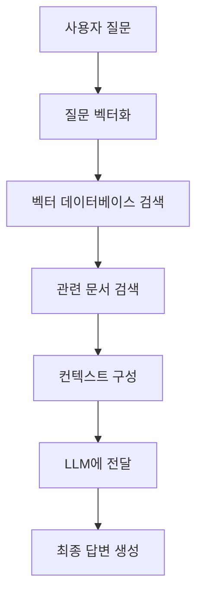

# RAG(Retrieval-Augmented Generation) 시스템

RAG는 최근 AI 분야에서 가장 주목받는 기술 중 하나입니다. 이 글에서는 RAG의 개념부터 실제 구현까지 단계별로 알아보겠습니다.

## 🤔 RAG란 무엇인가?

**RAG (Retrieval-Augmented Generation)**는 **검색 증강 생성**을 의미합니다. 

### 기존 LLM의 한계
- **훈련 데이터 시점 고정**: 특정 시점까지의 데이터만 학습
- **도메인 지식 부족**: 특정 분야의 전문 지식 부족
- **환각(Hallucination)**: 존재하지 않는 정보를 생성하는 문제

### RAG의 해결책
```
사용자 질문 → 관련 문서 검색 → LLM이 검색된 정보를 바탕으로 답변 생성
```

## 🏗️ RAG 시스템 아키텍처

### 기본 구성 요소



### 상세 프로세스

1. **문서 처리 (Document Processing)**
   - 원본 문서를 청크(chunk)로 분할
   - 각 청크를 벡터로 임베딩
   - 벡터 데이터베이스에 저장

2. **질의 처리 (Query Processing)**
   - 사용자 질문을 벡터로 변환
   - 유사도 검색으로 관련 문서 찾기

3. **생성 (Generation)**
   - 검색된 문서를 컨텍스트로 활용
   - LLM이 최종 답변 생성

## 🔍 검색 방식 비교

### 1. 벡터 검색 (Vector Search)

**장점:**
- 의미적 유사성 검색 가능
- 다국어 지원
- 문맥 이해 능력

**단점:**
- 정확한 키워드 매칭 어려움
- 계산 비용 높음

```python
# 벡터 검색 예시
from sentence_transformers import SentenceTransformer
import numpy as np

model = SentenceTransformer('all-MiniLM-L6-v2')

# 문서 임베딩
documents = ["인공지능은 미래 기술입니다", "머신러닝은 AI의 한 분야입니다"]
doc_embeddings = model.encode(documents)

# 질문 임베딩
query = "AI 기술에 대해 알려주세요"
query_embedding = model.encode([query])

# 유사도 계산
similarities = np.dot(query_embedding, doc_embeddings.T)
```

### 2. 키워드 검색 (BM25)

**장점:**
- 정확한 키워드 매칭
- 빠른 검색 속도
- 해석 가능성

**단점:**
- 동의어 처리 어려움
- 의미적 유사성 부족

### 3. 하이브리드 검색

**벡터 검색 + BM25**를 결합하여 두 방식의 장점을 모두 활용:

```python
# 하이브리드 검색 예시
def hybrid_search(query, documents, vector_weight=0.7, bm25_weight=0.3):
    # 벡터 검색 점수
    vector_scores = vector_search(query, documents)
    
    # BM25 검색 점수
    bm25_scores = bm25_search(query, documents)
    
    # 가중 평균
    final_scores = vector_weight * vector_scores + bm25_weight * bm25_scores
    
    return final_scores
```

## 🛠️ 실제 구현 예시

### 1. LangChain을 활용한 RAG 시스템

```python
from langchain.document_loaders import TextLoader
from langchain.text_splitter import RecursiveCharacterTextSplitter
from langchain.embeddings import OpenAIEmbeddings
from langchain.vectorstores import Chroma
from langchain.chains import RetrievalQA
from langchain.llms import OpenAI

# 1. 문서 로드 및 분할
loader = TextLoader("document.txt")
documents = loader.load()

text_splitter = RecursiveCharacterTextSplitter(
    chunk_size=1000,
    chunk_overlap=200
)
texts = text_splitter.split_documents(documents)

# 2. 벡터 저장소 생성
embeddings = OpenAIEmbeddings()
vectorstore = Chroma.from_documents(texts, embeddings)

# 3. RAG 체인 구성
qa_chain = RetrievalQA.from_chain_type(
    llm=OpenAI(),
    chain_type="stuff",
    retriever=vectorstore.as_retriever()
)

# 4. 질의응답
result = qa_chain.run("인공지능의 미래는 어떻게 될까요?")
print(result)
```

### 2. 한국어 특화 RAG 시스템

```python
from transformers import AutoTokenizer, AutoModel
import torch

# 한국어 임베딩 모델
tokenizer = AutoTokenizer.from_pretrained('jhgan/ko-sroberta-multitask')
model = AutoModel.from_pretrained('jhgan/ko-sroberta-multitask')

def get_korean_embedding(text):
    inputs = tokenizer(text, return_tensors='pt', padding=True, truncation=True)
    with torch.no_grad():
        outputs = model(**inputs)
    return outputs.last_hidden_state.mean(dim=1)

# 한국어 문서 임베딩
korean_docs = ["인공지능은 인간의 지능을 모방한 기술입니다", 
               "머신러닝은 데이터로부터 패턴을 학습합니다"]
korean_embeddings = [get_korean_embedding(doc) for doc in korean_docs]
```

## 📊 성능 최적화 전략

### 1. 청크 크기 최적화

```python
# 청크 크기별 성능 비교
chunk_sizes = [200, 500, 1000, 2000]
results = []

for chunk_size in chunk_sizes:
    splitter = RecursiveCharacterTextSplitter(
        chunk_size=chunk_size,
        chunk_overlap=chunk_size // 10
    )
    chunks = splitter.split_documents(documents)
    
    # 성능 측정
    accuracy = evaluate_rag_system(chunks)
    results.append((chunk_size, accuracy))

# 최적 청크 크기 선택
optimal_chunk_size = max(results, key=lambda x: x[1])[0]
```

### 2. 재랭킹 (Re-ranking)

```python
from sentence_transformers import CrossEncoder

# 재랭킹 모델
reranker = CrossEncoder('cross-encoder/ms-marco-MiniLM-L-6-v2')

def rerank_documents(query, documents, top_k=5):
    # 초기 검색
    initial_results = vector_search(query, documents, top_k=20)
    
    # 재랭킹
    pairs = [(query, doc) for doc in initial_results]
    scores = reranker.predict(pairs)
    
    # 상위 k개 선택
    reranked_indices = np.argsort(scores)[::-1][:top_k]
    return [initial_results[i] for i in reranked_indices]
```

### 3. 메타데이터 필터링

```python
# 메타데이터를 활용한 필터링
def filtered_search(query, documents, metadata_filter):
    # 벡터 검색
    vector_results = vector_search(query, documents)
    
    # 메타데이터 필터링
    filtered_results = []
    for doc, score in vector_results:
        if matches_metadata(doc.metadata, metadata_filter):
            filtered_results.append((doc, score))
    
    return filtered_results

# 사용 예시
metadata_filter = {"category": "technology", "date": "2024"}
results = filtered_search("AI 기술", documents, metadata_filter)
```

## 🎯 실제 활용 사례

### 1. 고객 서비스 챗봇

```python
# 고객 서비스 RAG 시스템
class CustomerServiceRAG:
    def __init__(self):
        self.knowledge_base = self.build_knowledge_base()
        self.qa_chain = self.setup_qa_chain()
    
    def build_knowledge_base(self):
        # FAQ, 매뉴얼, 정책 문서 등 로드
        documents = load_customer_service_docs()
        return create_vector_store(documents)
    
    def answer_question(self, question):
        # 관련 문서 검색
        relevant_docs = self.knowledge_base.similarity_search(question, k=3)
        
        # 답변 생성
        context = "\n".join([doc.page_content for doc in relevant_docs])
        prompt = f"Context: {context}\nQuestion: {question}\nAnswer:"
        
        return self.qa_chain.run(prompt)
```

### 2. 법률 문서 분석

```python
# 법률 문서 RAG 시스템
class LegalDocumentRAG:
    def __init__(self):
        self.legal_kb = self.load_legal_documents()
        self.legal_llm = self.setup_legal_llm()
    
    def load_legal_documents(self):
        # 법률, 판례, 해석례 등 로드
        legal_docs = load_legal_corpus()
        return create_legal_vector_store(legal_docs)
    
    def analyze_legal_question(self, question):
        # 관련 법률 조항 검색
        relevant_laws = self.legal_kb.similarity_search(question, k=5)
        
        # 법률 분석 및 답변 생성
        return self.generate_legal_analysis(question, relevant_laws)
```

## 🚀 고급 RAG 기법

### 1. Multi-Query RAG

```python
def multi_query_rag(query):
    # 여러 관점의 질문 생성
    perspectives = [
        f"기술적 관점에서 {query}",
        f"비즈니스 관점에서 {query}",
        f"사용자 관점에서 {query}"
    ]
    
    # 각 관점별로 검색
    all_results = []
    for perspective in perspectives:
        results = vector_search(perspective, documents)
        all_results.extend(results)
    
    # 중복 제거 및 재랭킹
    unique_results = remove_duplicates(all_results)
    return rerank_documents(query, unique_results)
```

### 2. Self-RAG

```python
def self_rag(query):
    # 초기 답변 생성
    initial_answer = generate_answer(query)
    
    # 답변 검증
    verification = verify_answer(initial_answer, query)
    
    if verification.confidence < 0.8:
        # 추가 검색 수행
        additional_docs = search_for_gaps(initial_answer, query)
        refined_answer = refine_answer(initial_answer, additional_docs)
        return refined_answer
    
    return initial_answer
```

## 📈 성능 평가 지표

### 1. 검색 품질 지표

```python
def evaluate_retrieval_quality(query, retrieved_docs, relevant_docs):
    # Precision@K
    precision_at_k = len(set(retrieved_docs) & set(relevant_docs)) / len(retrieved_docs)
    
    # Recall@K
    recall_at_k = len(set(retrieved_docs) & set(relevant_docs)) / len(relevant_docs)
    
    # MRR (Mean Reciprocal Rank)
    mrr = 0
    for i, doc in enumerate(retrieved_docs):
        if doc in relevant_docs:
            mrr = 1 / (i + 1)
            break
    
    return {
        "precision": precision_at_k,
        "recall": recall_at_k,
        "mrr": mrr
    }
```

### 2. 생성 품질 지표

```python
def evaluate_generation_quality(generated_answer, reference_answer):
    # BLEU 점수
    bleu_score = calculate_bleu(generated_answer, reference_answer)
    
    # ROUGE 점수
    rouge_score = calculate_rouge(generated_answer, reference_answer)
    
    # 의미적 유사도
    semantic_similarity = calculate_semantic_similarity(
        generated_answer, reference_answer
    )
    
    return {
        "bleu": bleu_score,
        "rouge": rouge_score,
        "semantic_similarity": semantic_similarity
    }
```

## 🎯 마무리

RAG는 LLM의 한계를 극복하고 더 정확하고 신뢰할 수 있는 AI 시스템을 구축할 수 있게 해주는 혁신적인 기술입니다.

### 핵심 포인트

1. **검색 + 생성**: 관련 정보를 검색하여 LLM의 답변 품질 향상
2. **실시간 정보**: 최신 정보를 반영한 답변 생성 가능
3. **도메인 특화**: 특정 분야의 전문 지식 활용 가능
4. **환각 방지**: 검색된 문서를 바탕으로 한 신뢰할 수 있는 답변

### 다음 단계

- **멀티모달 RAG**: 텍스트, 이미지, 오디오를 모두 활용
- **실시간 RAG**: 실시간 데이터 스트림과 연동
- **개인화 RAG**: 사용자별 맞춤형 지식 베이스

RAG 기술을 활용하여 더욱 지능적이고 유용한 AI 시스템을 구축해보세요!

---

**참고 자료:**
- [RAG 논문](https://arxiv.org/abs/2005.11401)
- [LangChain RAG 가이드](https://python.langchain.com/docs/use_cases/question_answering/)
- [Chroma 벡터 데이터베이스](https://www.trychroma.com/)

*이 글이 도움이 되셨다면 댓글로 피드백을 남겨주세요! 🚀*
