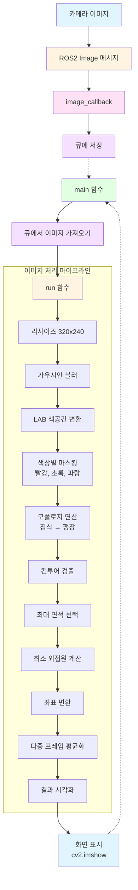

# 색상 인식

---

## 개요

> OpenCV와 ROS2를 활용하여 카메라 이미지에서 빨강, 초록, 파랑 색상을 실시간으로 감지하도록하며, LAB 색공간을 사용하여 조명 변화에 강건한 색상 인식을 구현하며, 모폴로지 연산과 컨투어 검출을 통해 정확한 색상 영역을 찾는 프로젝트 입니다.
> 

## 동작 확인


```bash
python3 /home/ubuntu/ros2_ws/src/example/example/color_detect/color_detect_demo.py
```


## 동작 원리

1. **이미지 수신**: ROS2를 통해 카메라 이미지를 구독
2. **이미지 전처리**: 리사이즈, 가우시안 블러, LAB 색공간 변환을 수행
3. **색상 마스킹**: YAML 파일에서 읽은 색상 범위를 사용하여 각 색상(빨강, 초록, 파랑)에 대한 마스크를 생성
4. **모폴로지 연산**: 침식(Erosion)과 팽창(Dilation)을 통해 노이즈를 제거
5. **컨투어 검출**: 마스크에서 색상 영역의 경계선(컨투어)을 찾음
6. **최대 면적 선택**: 각 색상 중 가장 큰 면적을 가진 색상을 선택
7. **위치 계산**: 최소 외접원을 계산하여 색상 영역의 중심과 반지름을 구함
8. **안정화**: 여러 프레임의 결과를 평균화하여 안정적인 색상 인식을 수행

## 프로그램 구조


# 주요 사용 기술
## 모폴로지(**Morphology)** 연산


- 바이너리 이미지에서 형태를 분석하고 변형하는 연산으로, 노이즈 제거와 영역 정리에 사용

### **침식 (Erosion)**


- 구조 요소(커널)를 이미지 위에서 이동시키며, 커널 내의 모든 픽셀이 1일 때만 중심 픽셀을 1로 설정
- 작은 노이즈 제거, 객체 축소 효과

### **팽창 (Dilation)**


- 구조 요소 내의 픽셀 중 하나라도 1이면 중심 픽셀을 1로 설정
- 침식으로 줄어든 영역 복원, 객체 확대 효과


**사용 예시**

```python
# 구조 요소 생성 (3x3 사각형)
kernel = cv2.getStructuringElement(cv2.MORPH_RECT, (3, 3))

# 침식: 작은 노이즈 제거
eroded = cv2.erode(frame_mask, kernel)

# 팽창: 침식으로 줄어든 영역 복원
dilated = cv2.dilate(eroded, kernel)
```

- **효과**
    - `침식 → 팽창` 순서로 수행하면 작은 노이즈가 제거되고 주요 영역은 유지
    - 이를 `Opening` 연산이라고도 함


## 컨투어(contour) 검출

### **컨투어(contour)란?**


- 바이너리 이미지에서 같은 색상(또는 강도)을 가진 픽셀들의 경계선을 연결한 곡선

**컨투어 검출 방법**

```python
# 컨투어 검출
contours = cv2.findContours(dilated, cv2.RETR_EXTERNAL, cv2.CHAIN_APPROX_NONE)[-2]
```

- **파라미터 설명**
    - `cv2.RETR_EXTERNAL`: 외부 컨투어만 검출 (내부 구멍 무시)
    - `cv2.CHAIN_APPROX_NONE`: 모든 컨투어 점을 저장 (정확한 경계선)

## 좌표 변환 함수 (`val_map`)

```python
def val_map(x, in_min, in_max, out_min, out_max):
    """
    선형 매핑 함수: 입력 범위의 값을 출력 범위로 변환합니다.
    예: val_map(160, 0, 320, 0, 640) = 320 (320x240 이미지의 중앙을 640x480 이미지의 중앙으로 변환)
    :param x: 입력 값
    :param in_min: 입력 최소값
    :param in_max: 입력 최대값
    :param out_min: 출력 최소값
    :param out_max: 출력 최대값
    :return: 변환된 값
    """
    return (x - in_min) * (out_max - out_min) / (in_max - in_min) + out_min
```

**사용 예시**

```python
# 리사이즈된 이미지(320x240)의 좌표를 원본 이미지 좌표로 변환
centerX = int(common.val_map(centerX, 0, size[0], 0, img_w))
centerY = int(common.val_map(centerY, 0, size[1], 0, img_h))
```

**수식**

```
출력값 = (입력값 - 입력최소) × (출력최대 - 출력최소) / (입력최대 - 입력최소) + 출력최소
```

## 다중 프레임 평균화

```python
# 3개 프레임의 색상 결과를 저장
color_list.append(color)

# 3개가 모이면 평균 계산
if len(color_list) == 3:
    color = int(round(np.mean(np.array(color_list))))
    color_list = []  # 리스트 초기화
```

- 단일 프레임의 결과는 노이즈나 일시적인 변화에 민감할 수 있으므로, 여러 프레임의 결과를 평균화하여 안정적인 색상 인식을 수행
- **효과**
    - 일시적인 오검출 방지
    - 색상 전환 시 부드러운 변화
    - 더 안정적인 색상 인식


# 코드 분석

---

## 1. 프로그램 시작 및 초기화

### 메인 함수

```python
if __name__ == '__main__':
    rclpy.init()  # ROS2 초기화
    node = rclpy.create_node('color_detect_node')  # 노드 생성
    # 카메라 이미지 구독 (토픽: /ascamera/camera_publisher/rgb0/image)
    node.create_subscription(Image, '/ascamera/camera_publisher/rgb0/image', image_callback, 1)
    # 메인 함수를 별도 스레드에서 실행 (데몬 스레드)
    threading.Thread(target=main, daemon=True).start()
    # ROS2 스핀 (콜백 함수 실행)
    rclpy.spin(node)
```

- 프로그램이 시작되면 먼저 ROS2를 초기화하고, 필요한 데이터를 로드
    1. ROS2 초기화 및 노드 생성
    2. 카메라 이미지 토픽 구독 설정 (`image_callback` 함수 연결)
    3. 메인 처리 루프를 별도 스레드에서 시작
    4. ROS2 스핀으로 콜백 함수 활성화

### 전역 변수 및 상수

```python
bridge = CvBridge()  # ROS 이미지 메시지와 OpenCV 이미지 간 변환을 위한 브리지

# RGB 색상 값 정의 (BGR 순서: OpenCV는 BGR 형식 사용)
range_rgb = {
    'red': (0, 0, 255),      # 빨강: B=0, G=0, R=255
    'blue': (255, 0, 0),     # 파랑: B=255, G=0, R=0
    'green': (0, 255, 0),    # 초록: B=0, G=255, R=0
    'black': (0, 0, 0),      # 검정
    'white': (255, 255, 255), # 흰색
}

size = (320, 240)  # 처리할 이미지 크기 (너비, 높이) - 작은 크기로 처리 속도 향상
```

### YAML 파일 읽기 함수

```python
def get_yaml_data(yaml_file):
    """
    YAML 파일에서 색상 범위 데이터를 읽어옵니다.
    :param yaml_file: YAML 파일 경로
    :return: YAML 파일의 데이터 (딕셔너리)
    """
    yaml_file = open(yaml_file, 'r', encoding='utf-8')
    file_data = yaml_file.read()
    yaml_file.close()
    
    # YAML 파일을 파싱하여 딕셔너리로 변환
    data = yaml.load(file_data, Loader=yaml.FullLoader)
    
    return data

# LAB 색공간에서의 색상 범위 데이터 로드
lab_data = get_yaml_data("/home/ubuntu/software/lab_tool/lab_config.yaml")
```

- **YAML 파일 구조**
    - `lab_data['lab']['Stereo'][색상명]['min']`: 최소 LAB 값
    - `lab_data['lab']['Stereo'][색상명]['max']`: 최대 LAB 값

## 2. 이미지 수신 및 처리 흐름

### 이미지 콜백 함수

```python
image_queue = queue.Queue(2)  # 최대 2개의 이미지를 저장하는 큐

def image_callback(ros_image):
    """
    ROS2 이미지 메시지를 받아서 큐에 저장합니다.
    :param ros_image: ROS2 Image 메시지
    """
    # ROS 이미지 메시지를 OpenCV 이미지로 변환 (BGR 형식)
    cv_image = bridge.imgmsg_to_cv2(ros_image, "bgr8")
    bgr_image = np.array(cv_image, dtype=np.uint8)
    
    # 큐가 가득 찬 경우 가장 오래된 이미지 제거 (최신 이미지 유지)
    if image_queue.full():
        image_queue.get()
    # 새 이미지를 큐에 추가
    image_queue.put(bgr_image)
```

- **큐 사용 이유**
    - 이미지 처리 속도가 이미지 수신 속도보다 느릴 수 있으므로, 큐를 사용하여 최신 이미지만 처리
    - 큐 크기를 2로 제한하여 메모리 사용량을 제어

### 이미지 처리 (Main 루프)

```python
def main():
    """
    메인 루프: 큐에서 이미지를 가져와 색상 인식을 수행하고 화면에 표시합니다.
    """
    running = True
    while running:
        try:
            # 큐에서 이미지 가져오기 (최대 1초 대기)
            image = image_queue.get(block=True, timeout=1)
        except queue.Empty:
            # 큐가 비어있으면 계속 대기
            if not running:
                break
            else:
                continue
        
        # 색상 인식 수행
        image = run(image)
        
        # 결과 이미지 화면에 표시
        cv2.imshow('image', image)
        
        # 키 입력 확인 (q 또는 ESC 키로 종료)
        key = cv2.waitKey(1)
        if key == ord('q') or key == 27:
            break

    # OpenCV 창 닫기
    cv2.destroyAllWindows()
    rclpy.shutdown()
```

### 색상 인식 핵심 로직 (`run` 함수)

```python
def run(img):
    """
    입력 이미지에서 색상을 감지하고 결과를 시각화합니다.
    :param img: 입력 이미지 (BGR 형식)
    :return: 색상 인식 결과가 그려진 이미지
    """
    global draw_color
    global color_list
    global detect_color
    
    img_copy = img.copy()  # 원본 이미지 보존을 위한 복사
    img_h, img_w = img.shape[:2]  # 원본 이미지 크기 저장

    # 이미지 전처리
    # 1. 리사이즈: 처리 속도 향상을 위해 작은 크기로 변환
    frame_resize = cv2.resize(img_copy, size, interpolation=cv2.INTER_NEAREST)
    # 2. 가우시안 블러: 노이즈 제거 (커널 크기 3x3, 표준편차 3)
    frame_gb = cv2.GaussianBlur(frame_resize, (3, 3), 3)
    # 3. LAB 색공간 변환: 조명 변화에 강건한 색상 인식을 위해 사용
    frame_lab = cv2.cvtColor(frame_gb, cv2.COLOR_BGR2LAB)

    max_area = 0  # 최대 면적 초기화
    color_area_max = None  # 최대 면적을 가진 색상
    areaMaxContour_max = 0  # 최대 면적 컨투어
    
    # 빨강, 초록, 파랑 색상을 순차적으로 검사
    for i in ['red', 'green', 'blue']:
        # 색상 마스킹: LAB 색공간에서 색상 범위 내의 픽셀만 선택
        frame_mask = cv2.inRange(frame_lab, 
                                 tuple(lab_data['lab']['Stereo'][i]['min']), 
                                 tuple(lab_data['lab']['Stereo'][i]['max']))
        
        # 모폴로지 연산: 노이즈 제거 및 영역 정리
        # 1. 침식(Erosion): 작은 노이즈 제거
        eroded = cv2.erode(frame_mask, cv2.getStructuringElement(cv2.MORPH_RECT, (3, 3)))
        # 2. 팽창(Dilation): 침식으로 줄어든 영역 복원
        dilated = cv2.dilate(eroded, cv2.getStructuringElement(cv2.MORPH_RECT, (3, 3)))
        
        # 컨투어 검출: 색상 영역의 경계선 찾기
        contours = cv2.findContours(dilated, cv2.RETR_EXTERNAL, cv2.CHAIN_APPROX_NONE)[-2]
        # 최대 면적 컨투어 찾기
        areaMaxContour, area_max = getAreaMaxContour(contours)
        
        if areaMaxContour is not None:
            # 현재까지 찾은 최대 면적보다 크면 업데이트
            if area_max > max_area:
                max_area = area_max
                color_area_max = i  # 색상 이름 저장
                areaMaxContour_max = areaMaxContour  # 컨투어 저장
    
    # 최대 면적이 200 이상일 때만 색상으로 인정 (작은 영역 제외)
    if max_area > 200:
        # 최소 외접원 계산: 색상 영역을 감싸는 가장 작은 원
        ((centerX, centerY), radius) = cv2.minEnclosingCircle(areaMaxContour_max)
        
        # 좌표 변환: 리사이즈된 이미지 좌표를 원본 이미지 좌표로 변환
        centerX = int(common.val_map(centerX, 0, size[0], 0, img_w))
        centerY = int(common.val_map(centerY, 0, size[1], 0, img_h))
        radius = int(common.val_map(radius, 0, size[0], 0, img_w))
        
        # 원본 이미지에 원 그리기 (색상 영역 표시)
        cv2.circle(img, (centerX, centerY), radius, range_rgb[color_area_max], 2)

        # 색상을 숫자로 변환 (안정화를 위한 평균 계산용)
        if color_area_max == 'red':
            color = 1
        elif color_area_max == 'green':
            color = 2
        elif color_area_max == 'blue':
            color = 3
        else:
            color = 0
        
        color_list.append(color)  # 색상 리스트에 추가

        # 3개 프레임의 결과를 평균화하여 안정적인 색상 인식
        if len(color_list) == 3:
            # 평균값 계산 (반올림)
            color = int(round(np.mean(np.array(color_list))))
            color_list = []  # 리스트 초기화
            
            # 평균값에 따라 최종 색상 결정
            if color == 1:
                detect_color = 'red'
                draw_color = range_rgb["red"]
            elif color == 2:
                detect_color = 'green'
                draw_color = range_rgb["green"]
            elif color == 3:
                detect_color = 'blue'
                draw_color = range_rgb["blue"]
            else:
                detect_color = 'None'
                draw_color = range_rgb["black"]
    else:
        # 면적이 너무 작으면 색상 없음으로 판단
        detect_color = 'None'
        draw_color = range_rgb["black"]
    
    # 이미지에 색상 정보 텍스트 표시
    cv2.putText(img, "Color: " + detect_color, (10, img.shape[0] - 10), 
                cv2.FONT_HERSHEY_SIMPLEX, 0.65, draw_color, 2)
    
    return img
```

- **처리 단계**
    1. **전처리**: 리사이즈 → 가우시안 블러 → LAB 색공간 변환
    2. **색상별 검사**: 빨강, 초록, 파랑 순서로 마스킹 → 모폴로지 연산 → 컨투어 검출
    3. **최대 면적 선택**: 각 색상 중 가장 큰 면적을 가진 색상 선택
    4. **위치 계산**: 최소 외접원으로 중심과 반지름 계산
    5. **좌표 변환**: 리사이즈된 좌표를 원본 이미지 좌표로 변환
    6. **안정화**: 3개 프레임의 결과를 평균화하여 최종 색상 결정
    7. **시각화**: 원과 텍스트로 결과 표시

## 보조 함수

### 최대 면적 컨투어 찾기 함수

```python
def getAreaMaxContour(contours):
    """
    여러 컨투어 중에서 면적이 가장 큰 컨투어를 찾습니다.
    :param contours: 검출된 컨투어 리스트
    :return: 최대 면적 컨투어, 최대 면적 값
    """
    contour_area_temp = 0
    contour_area_max = 0
    area_max_contour = None

    for c in contours:  # 모든 컨투어를 순회
        # 컨투어의 면적 계산 (절댓값 사용)
        contour_area_temp = math.fabs(cv2.contourArea(c))
        if contour_area_temp > contour_area_max:
            contour_area_max = contour_area_temp
            # 면적이 50 이상일 때만 유효한 컨투어로 인정 (노이즈 필터링)
            if contour_area_temp > 50:
                area_max_contour = c

    return area_max_contour, contour_area_max
```

- **동작 원리**
    - 모든 컨투어의 면적을 계산하여 최대값을 찾음
    - 면적이 50 미만인 작은 컨투어는 노이즈로 간주하여 제외
        - 이렇게 하면 작은 반사나 그림자로 인한 오검출을 방지할 수 있음


## 코드 흐름도

