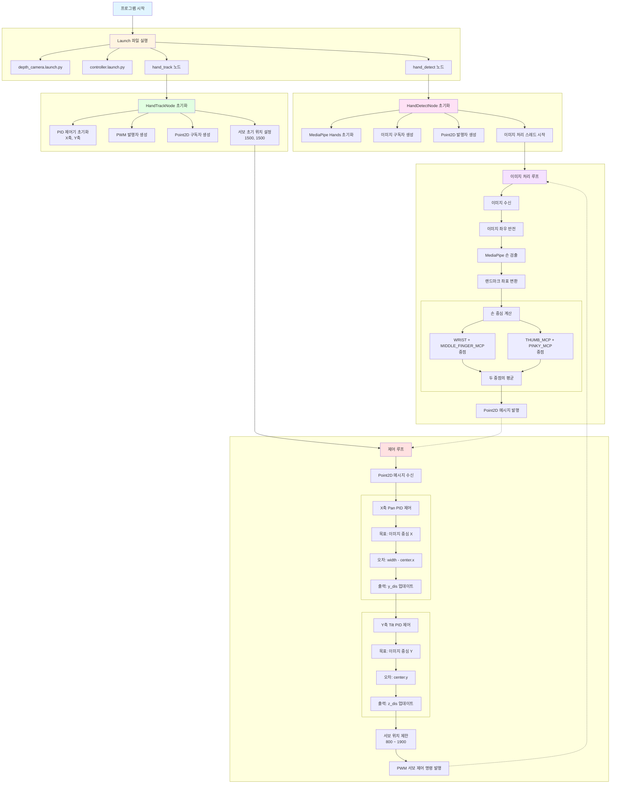
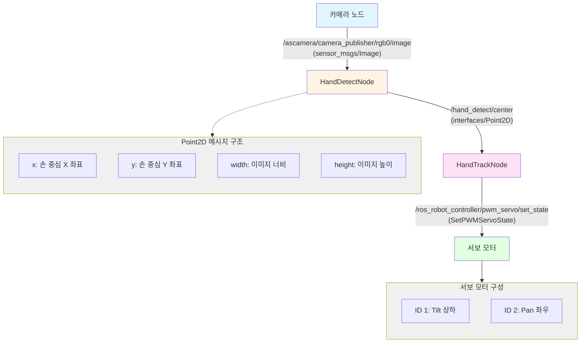

# Hand Follower

---

## 개요

> MediaPipe와 ROS2를 활용하여 카메라 이미지에서 손을 실시간으로 감지하고, PID 제어를 통해 틸팅 카메라가 손을 따라 움직이도록 하는 프로젝트입니다. 손의 중심 위치를 계산하여 카메라의 Pan/Tilt 서보 모터를 제어합니다.
> 

**주요 기능**

- **손 검출**: MediaPipe Hands를 사용한 실시간 손 랜드마크 검출
- **손 중심 계산**: 손바닥 중심 좌표 계산 및 발행
- **PID 제어**: 손 위치 편차를 PID 제어로 서보 각도 조정
- **틸팅 카메라 제어**: PWM 서보 모터를 통한 Pan/Tilt 제어

## 동작 확인


1. MentorPi를 시작하고 VNC Viewer에 연결합니다.
2. **Terminator**에서 아래 명령어를 입력해 ROS 2관련 자동 실행 서비스를 중지합니다.
    
    ```bash
    ~/.stop_ros.sh
    ```
    
3. Hand Follower 기능을 활성화하기 위해 명령어를 입력합니다.
    
    ```bash
    ros2 launch example hand_track_node.launch.py
    ```
    
4. 카메라 앞에서 손을 움직이면 틸팅 카메라가 손을 따라 움직입니다.
5. 실습을 종료하려면 터미널에서 `Ctrl+C`를 누릅니다.
6. **LXTerminal**에서 아래 명령어로 로봇 기능들을 다시 활성화하거나, 로봇을 재시작할 수 있습니다.
    
    ```bash
    sudo systemctl restart start_node.service
    ```
## 동작 원리

1. **이미지 수신**: ROS2를 통해 카메라 이미지를 구독
2. **손 검출**: MediaPipe Hands를 사용하여 손 랜드마크 21개 검출
3. **손 중심 계산**: 손바닥의 주요 랜드마크를 이용하여 중심 좌표 계산
4. **좌표 발행**: 손 중심 좌표를 Point2D 메시지로 발행
5. **PID 제어**: 손 중심과 이미지 중심의 편차를 PID 제어기로 처리
6. **서보 제어**: 계산된 PWM 값으로 Pan/Tilt 서보 모터 제어


## 프로그램 구조

### Launch 파일 구조


**주요 구성 요소**

- **HandDetectNode 클래스**: 손 검출 및 중심 좌표 계산
- **HandTrackNode 클래스**: PID 제어 및 서보 모터 제어
- **PID 제어기**: X축(Pan), Y축(Tilt) 각각의 PID 제어 (sdk.pid 모듈)

# 주요 사용 기술

---

## 손 중심 좌표 계산


> 손바닥의 중심 위치를 의미합니다. MediaPipe Hands에서 제공하는 21개의 랜드마크 중 손목(`WRIST`), 중지 MCP(`MIDDLE_FINGER_MCP`), 엄지 MCP(`THUMB_MCP`), 소지 MCP(`PINKY_MCP`)를 사용하여 손바닥 중심을 계산합니다.
>


### **계산 방법**

```python
# 손목과 중지 MCP의 중점
center_x1 = (landmarks[WRIST][0] + landmarks[MIDDLE_FINGER_MCP][0]) / 2
center_y1 = (landmarks[WRIST][1] + landmarks[MIDDLE_FINGER_MCP][1]) / 2

# 엄지 MCP와 소지 MCP의 중점
center_x2 = (landmarks[THUMB_MCP][0] + landmarks[PINKY_MCP][0]) / 2
center_y2 = (landmarks[THUMB_MCP][1] + landmarks[PINKY_MCP][1]) / 2

# 두 중점의 평균 = 손바닥 중심
center_x = int((center_x1 + center_x2) / 2)
center_y = int((center_y1 + center_y2) / 2)
```

- 두 개의 중점을 계산하여 평균을 구함으로써 손바닥의 정확한 중심을 얻음
- 손가락 끝이 아닌 손바닥 중심을 사용하여 안정적인 추적 가능


# 코드 분석

---

## 1. Launch 파일 구조

### **launch_setup 함수**

```python
def launch_setup(context):
    ...
    # 카메라 launch 포함
    depth_camera_launch = IncludeLaunchDescription(
        PythonLaunchDescriptionSource(
            **os.path.join(peripherals_package_path, 'launch/depth_camera.launch.py')),**
    )
    
    # 컨트롤러 launch 포함
    controller_launch = IncludeLaunchDescription(
        PythonLaunchDescriptionSource(
            **os.path.join(controller_package_path, 'launch/controller.launch.py')),**
    )

    # 손 검출 노드
    hand_detect_node = Node(
        package='example',
        **executable='hand_detect',**
        output='screen',
        parameters=[{'enable_display': enable_display}]
    )

    # 손 추적 노드
    hand_track_node = Node(
        package='example',
        **executable='hand_track',**
        output='screen',
    )

    return [enable_display_arg,
            depth_camera_launch,
            controller_launch,
            hand_detect_node,
            hand_track_node]
```

- **depth_camera_launch**: 카메라 노드 실행
- **controller_launch**: 로봇 컨트롤러 노드 실행
- **hand_detect_node**: 손 검출 노드 실행
- **hand_track_node**: 손 추적 노드 실행

## 2. HandDetectNode (손 검출 노드)

### **노드 초기화**

```python
class HandDetectNode(Node):
    def __init__(self, name):
        rclpy.init()
        super().__init__(name, allow_undeclared_parameters=True,
                         automatically_declare_parameters_from_overrides=True)
        
        # MediaPipe Hands 초기화
        self.hand_detector = mp.solutions.hands.Hands(
            static_image_mode=False,       # 비디오 스트림 모드
            max_num_hands=1,               # 최대 1개의 손 검출
            min_tracking_confidence=0.05,  # 추적 신뢰도 임계값
            min_detection_confidence=0.8   # 검출 신뢰도 임계값
        )
        
        # 발행자 생성
        self.result_publisher = self.create_publisher(Image, '~/image_result', 1)
        self.point_publisher = self.create_publisher(Point2D, '~/center', 1)
        
        # 이미지 구독자 생성
        self.image_sub = self.create_subscription(
            Image, '/%s/camera_publisher/rgb0/image' % self.camera,
            self.image_callback, 1)
        
        # 이미지 처리 스레드 시작
        threading.Thread(target=self.image_proc, daemon=True).start()
```

- **주요 파라미터**
    - `min_detection_confidence=0.8`: 높은 검출 신뢰도로 오검출 방지
    - `max_num_hands=1`: 단일 손만 추적하여 성능 최적화

### **이미지 콜백 함수**

```python
# hand_detect_node.py - HandDetectNode.image_callback
def image_callback(self, ros_image):
    cv_image = self.bridge.imgmsg_to_cv2(ros_image, "rgb8")
    rgb_image = np.array(cv_image, dtype=np.uint8)
    ...
    self.image_queue.put(rgb_image)
```

### **이미지 처리 함수**

```python
def image_proc(self):
    while self.running:
        ...
        # 이미지 좌우 반전 (거울 모드)
        image_flip = cv2.flip(image, 1)
        
        # MediaPipe 손 검출
        results = self.hand_detector.process(image_flip)
        
        if results is not None and results.multi_hand_landmarks:
            for hand_landmarks in results.multi_hand_landmarks:
                # 랜드마크 시각화
                self.drawing.draw_landmarks(
                    bgr_image, hand_landmarks,
                    mp.solutions.hands.HAND_CONNECTIONS)
                
                # 랜드마크 좌표 변환
                landmarks = get_hand_landmarks(image_flip, hand_landmarks.landmark)
                
                # 손 중심 계산
                center_x1 = (landmarks[WRIST][0] + landmarks[MIDDLE_FINGER_MCP][0]) / 2
                center_y1 = (landmarks[WRIST][1] + landmarks[MIDDLE_FINGER_MCP][1]) / 2
                center_x2 = (landmarks[THUMB_MCP][0] + landmarks[PINKY_MCP][0]) / 2
                center_y2 = (landmarks[THUMB_MCP][1] + landmarks[PINKY_MCP][1]) / 2
                center_x = int((center_x1 + center_x2) / 2)
                center_y = int((center_y1 + center_y2) / 2)
                
                # 중심점 시각화
                cv2.circle(bgr_image, (center_x, center_y), 10, (0, 255, 255), -1)
                
                # Point2D 메시지 설정
                point.x = center_x
                point.y = center_y
                point.width = w
                point.height = h
        
        # 결과 발행
        self.point_publisher.publish(point)
```

1. **이미지 전처리**: 좌우 반전 (거울 모드)
2. **손 검출**: MediaPipe Hands로 랜드마크 검출
3. **중심 계산**: 4개의 랜드마크를 사용하여 손바닥 중심 계산
4. **결과 발행**: Point2D 메시지로 중심 좌표 발행

## 3. HandTrackNode (손 추적 노드)

### **노드 초기화**

```python
class HandTrackNode(Node):
    def __init__(self, name):
        rclpy.init()
        super().__init__(name)
        
        # 초기 서보 위치
        self.z_dis = 0.41  # Tilt (상하)
        self.y_dis = 500   # Pan (좌우)

        # PID 제어기 초기화
        self.pid_z = pid.PID(0.1, 0.0002, 0.00001)  # Tilt PID
        self.pid_y = pid.PID(0.1, 0.0002, 0.00001)  # Pan PID

        # 발행자 생성
        self.pwm_pub = self.create_publisher(
            SetPWMServoState, 'ros_robot_controller/pwm_servo/set_state', 10)
        self.mecanum_pub = self.create_publisher(Twist, '/controller/cmd_vel', 1)

        # 손 중심 좌표 구독
        self.image_sub = self.create_subscription(
            Point2D, '/hand_detect/center', self.get_hand_callback, 1)
```

- **주요 파라미터**
    - `self.z_dis`: Tilt 서보 위치 (상하 움직임)
    - `self.y_dis`: Pan 서보 위치 (좌우 움직임)
    - `pid.PID(0.1, 0.0002, 0.00001)`: P, I, D 게인 값

### **초기화 동작**

```python
def init_action(self):
    self.mecanum_pub.publish(Twist())  # 로봇 정지
    self.pwm_controller([1500, 1500])  # 서보 중앙 위치
```

### **손 좌표 콜백**

```python
def get_hand_callback(self, msg):
    if msg.width != 0:
        self.center = msg  # 유효한 좌표 저장
    else:
        self.center = None  # 손이 검출되지 않음
```


### **메인 제어 루프**

```python
def main(self):
    while self.running:
        if self.center is not None:
            # X축(Pan) PID 제어
            self.pid_y.SetPoint = self.center.width / 2  # 목표: 이미지 중심
            self.pid_y.update(self.center.width - self.center.x)
            self.y_dis += self.pid_y.output
            
            # 서보 위치 제한
            if self.y_dis < 800:
                self.y_dis = 800
            if self.y_dis > 1900:
                self.y_dis = 1900

            # Y축(Tilt) PID 제어
            self.pid_z.SetPoint = self.center.height / 2  # 목표: 이미지 중심
            self.pid_z.update(self.center.y)
            self.z_dis -= self.pid_z.output
            
            # 서보 위치 제한
            if self.z_dis > 1900:
                self.z_dis = 1900
            if self.z_dis < 800:
                self.z_dis = 800
            
            # 서보 제어 명령 발행
            self.pwm_controller([self.z_dis, self.y_dis])
            ...
        else:
            time.sleep(0.01)
```

1. **X축(Pan) 제어**: 손이 이미지 중심에서 벗어난 정도를 계산하여 좌우 서보 제어
2. **Y축(Tilt) 제어**: 손의 Y 좌표를 이용하여 상하 서보 제어
3. **위치 제한**: 서보 위치를 800~1900 범위로 제한
4. **서보 제어**: PWM 메시지 발행


### **PWM 서보 제어 함수**

```python
def pwm_controller(self, position_data):
    pwm_list = []
    msg = SetPWMServoState()
    msg.duration = 0.2  # 이동 시간 (초)
    
    for i in range(len(position_data)):
        pos = PWMServoState()
        pos.id = [i + 1]  # 서보 ID (1: Tilt, 2: Pan)
        pos.position = [int(position_data[i])]
        pwm_list.append(pos)
    
    msg.state = pwm_list
    self.pwm_pub.publish(msg)
```


```python
def pwm_controller(self, position_data):
    pwm_list = []
    msg = SetPWMServoState()
    msg.duration = 0.2  # 이동 시간 (초)
    
    for i in range(len(position_data)):
        pos = PWMServoState()
        pos.id = [i + 1]  # 서보 ID (1: Tilt, 2: Pan)
        pos.position = [int(position_data[i])]
        pwm_list.append(pos)
    
    msg.state = pwm_list
    self.pwm_pub.publish(msg)
```

## 코드 흐름도



## 노드 간 통신 구조
