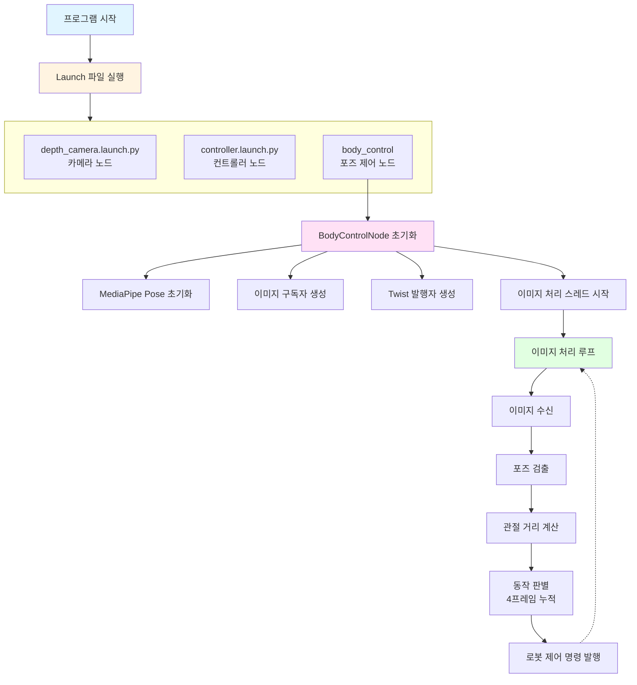
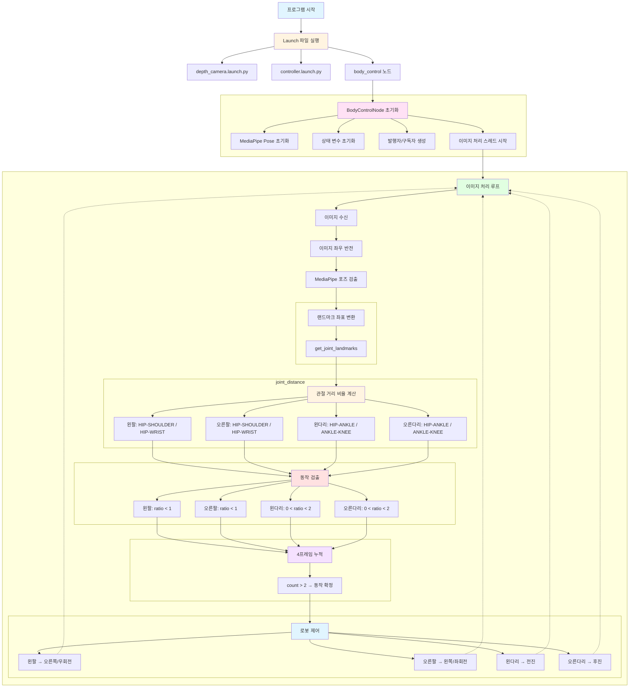
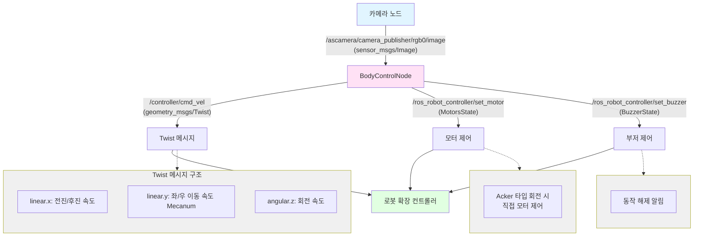

# Body Control

---

## 개요

> MediaPipe Pose와 ROS2를 활용하여 사람의 포즈(자세)를 실시간으로 인식하고, 특정 동작에 따라 로봇의 주행을 제어하는 프로젝트입니다. 팔과 다리의 위치 관계를 분석하여 전진, 후진, 좌회전, 우회전 명령을 생성합니다.
> 

**주요 기능**

- **포즈 검출**: MediaPipe Pose를 사용한 실시간 신체 랜드마크 검출
- **동작 인식**: 팔/다리 위치 관계를 통한 4가지 동작 인식
- **로봇 제어**: 인식된 동작에 따른 로봇 주행 제어 (전진/후진/좌/우)
- **노이즈 필터링**: 연속 프레임 분석을 통한 안정적인 동작 인식

## 동작 확인


1. MentorPi를 시작하고 VNC Viewer에 연결합니다.
2. **Terminator**에서 아래 명령어를 입력해 ROS 2관련 자동 실행 서비스를 중지합니다.
    
    ```bash
    ~/.stop_ros.sh
    ```
    
3. Body Control 기능을 활성화하기 위해 명령어를 입력합니다.
    
    ```bash
    ros2 launch example body_control.launch.py
    ```
    
4. 카메라 앞에서 다음 동작을 수행하면 로봇이 해당 방향으로 이동합니다:
    - **왼팔 들기**: 오른쪽 이동 (Mecanum) / 우회전 (Acker)
    - **오른팔 들기**: 왼쪽 이동 (Mecanum) / 좌회전 (Acker)
    - **왼다리 들기**: 전진
    - **오른다리 들기**: 후진
5. 실습을 종료하려면 터미널에서 `Ctrl+C`를 누르거나 `q` 또는 `ESC` 키를 누릅니다.
6. **LXTerminal**에서 아래 명령어로 로봇 기능들을 다시 활성화하거나, 로봇을 재시작할 수 있습니다.
    
    ```bash
    sudo systemctl restart start_node.service
    ```
    

## 동작 원리

1. **이미지 수신**: ROS2를 통해 카메라 이미지를 구독
2. **포즈 검출**: MediaPipe Pose를 사용하여 신체 랜드마크 33개 검출
3. **관절 거리 계산**: 팔/다리의 주요 관절 간 거리 비율 계산
4. **동작 판별**: 거리 비율을 기반으로 팔/다리 들기 동작 판별
5. **노이즈 필터링**: 4프레임 연속 분석으로 안정적인 동작 인식
6. **로봇 제어**: 인식된 동작에 따라 Twist 메시지 발행

## 프로그램 구조



# 주요 사용 기술

---

## 관절 거리 비율 계산

> 신체의 특정 관절 간 거리를 비교하여 팔이나 다리가 들려있는지 판단하는 방법입니다.
> 

### **사용되는 랜드마크**

```
0 - nose
1 - left eye (inner)
2 - left eye
3 - left eye (outer)
4 - right eye (inner)
5 - right eye
6 - right eye (outer)
7 - left ear
8 - right ear
9 - mouth (left)
10 - mouth (right)
11 - left shoulder
12 - right shoulder
13 - left elbow
14 - right elbow
15 - left wrist
16 - right wrist
17 - left pinky
18 - right pinky
19 - left index
20 - right index
21 - left thumb
22 - right thumb
23 - left hip
24 - right hip
25 - left knee
26 - right knee
27 - left ankle
28 - right ankle
29 - left heel
30 - right heel
31 - left foot index
32 - right foot index
```

```python
# 팔 관련 랜드마크
LEFT_SHOULDER = mp_pose.PoseLandmark.LEFT_SHOULDER   # 왼쪽 어깨
LEFT_ELBOW = mp_pose.PoseLandmark.LEFT_ELBOW         # 왼쪽 팔꿈치
LEFT_WRIST = mp_pose.PoseLandmark.LEFT_WRIST         # 왼쪽 손목
LEFT_HIP = mp_pose.PoseLandmark.LEFT_HIP             # 왼쪽 엉덩이

RIGHT_SHOULDER = mp_pose.PoseLandmark.RIGHT_SHOULDER # 오른쪽 어깨
RIGHT_ELBOW = mp_pose.PoseLandmark.RIGHT_ELBOW       # 오른쪽 팔꿈치
RIGHT_WRIST = mp_pose.PoseLandmark.RIGHT_WRIST       # 오른쪽 손목
RIGHT_HIP = mp_pose.PoseLandmark.RIGHT_HIP           # 오른쪽 엉덩이

# 다리 관련 랜드마크
LEFT_KNEE = mp_pose.PoseLandmark.LEFT_KNEE           # 왼쪽 무릎
LEFT_ANKLE = mp_pose.PoseLandmark.LEFT_ANKLE         # 왼쪽 발목

RIGHT_KNEE = mp_pose.PoseLandmark.RIGHT_KNEE         # 오른쪽 무릎
RIGHT_ANKLE = mp_pose.PoseLandmark.RIGHT_ANKLE       # 오른쪽 발목
```

### **거리 비율 계산 방법**

```python
# 왼팔 거리 비율 계산
d1 = landmarks[LEFT_HIP] - landmarks[LEFT_SHOULDER]   # 엉덩이-어깨 거리
d2 = landmarks[LEFT_HIP] - landmarks[LEFT_WRIST]      # 엉덩이-손목 거리
dis1 = d1[0]**2 + d1[1]**2  # 거리 제곱
dis2 = d2[0]**2 + d2[1]**2
ratio = dis1 / dis2  # 비율 계산
```

### **동작 판별 기준**

| 동작 | 조건 | 로봇 동작 (M1) | 로봇 동작 (A1) |
| --- | --- | --- | --- |
| 왼팔 들기 | distance_list[0] < 1 | 오른쪽 이동 | 우회전 |
| 오른팔 들기 | distance_list[1] < 1 | 왼쪽 이동 | 좌회전 |
| 왼다리 들기 | 0 < distance_list[2] < 2 | 전진 | 전진 |
| 오른다리 들기 | 0 < distance_list[3] < 2 | 후진 | 후진 |


# 코드 분석

---

## 1. Launch 파일 구조

### **launch_setup 함수**

```python
def launch_setup(context):
    ...
    # 카메라 launch 포함
    depth_camera_launch = IncludeLaunchDescription(
        PythonLaunchDescriptionSource(
            os.path.join(peripherals_package_path, 'launch/depth_camera.launch.py')),
    )
    
    # 컨트롤러 launch 포함
    controller_launch = IncludeLaunchDescription(
        PythonLaunchDescriptionSource(
            os.path.join(controller_package_path, 'launch/controller.launch.py')),
    )

    # Body Control 노드
    body_control_node = Node(
        package='example',
        executable='body_control',
        output='screen',
    )

    return [depth_camera_launch,
            controller_launch,
            body_control_node]
```

- **depth_camera_launch**: 카메라 노드 실행
- **controller_launch**: 로봇 컨트롤러 노드 실행
- **body_control_node**: 포즈 제어 노드 실행

## 2. BodyControlNode 클래스

### **노드 초기화**

```python
class BodyControlNode(Node):
    def __init__(self, name):
        rclpy.init()
        super().__init__(name, allow_undeclared_parameters=True,
                         automatically_declare_parameters_from_overrides=True)
        
        # MediaPipe Pose 초기화
        self.body_detector = mp_pose.Pose(
            static_image_mode=False,        # 비디오 스트림 모드
            min_tracking_confidence=0.7,    # 추적 신뢰도 임계값
            min_detection_confidence=0.7    # 검출 신뢰도 임계값
        )
        
        # 상태 변수 초기화
        self.move_finish = True      # 이동 완료 플래그
        self.stop_flag = False       # 정지 플래그
        self.left_hand_count = []    # 왼팔 동작 누적
        self.right_hand_count = []   # 오른팔 동작 누적
        self.left_leg_count = []     # 왼다리 동작 누적
        self.right_leg_count = []    # 오른다리 동작 누적
        
        self.detect_status = [0, 0, 0, 0]  # 현재 프레임 검출 상태
        self.move_status = [0, 0, 0, 0]    # 이동 명령 상태
        
        # 로봇 타입 확인
        self.machine_type = os.environ.get('MACHINE_TYPE')
        
        # 발행자 생성
        self.mecanum_pub = self.create_publisher(Twist, '/controller/cmd_vel', 1)
        self.buzzer_pub = self.create_publisher(BuzzerState, '/ros_robot_controller/set_buzzer', 1)
        self.motor_pub = self.create_publisher(MotorsState, '/ros_robot_controller/set_motor', 1)
        
        # 이미지 구독자 생성
        self.create_subscription(Image, '/ascamera/camera_publisher/rgb0/image',
                                 self.image_callback, 1)
```

- **주요 파라미터**
    - `min_detection_confidence=0.7`: 검출 신뢰도 70% 이상
    - `min_tracking_confidence=0.7`: 추적 신뢰도 70% 이상
    - `machine_type`: 로봇 타입 (Mecanum / Acker)

### **이미지 콜백 함수**

```python
def image_callback(self, ros_image):
    cv_image = self.bridge.imgmsg_to_cv2(ros_image, "rgb8")
    rgb_image = np.array(cv_image, dtype=np.uint8)
    ...
    self.image_queue.put(rgb_image)
```

## 3. 랜드마크 좌표 변환

### **get_joint_landmarks 함수**

```python
def get_joint_landmarks(img, landmarks):
    """
    MediaPipe의 정규화된 좌표를 픽셀 좌표로 변환
    :param img: 이미지
    :param landmarks: 정규화된 랜드마크
    :return: 픽셀 좌표 배열
    """
    h, w, _ = img.shape
    landmarks = [(lm.x * w, lm.y * h) for lm in landmarks]
    return np.array(landmarks)
```

- MediaPipe는 0~1 사이의 정규화된 좌표를 반환
- 이미지 크기를 곱하여 실제 픽셀 좌표로 변환

## 4. 관절 거리 계산

### **joint_distance 함수**

```python
def joint_distance(landmarks):
    distance_list = []

    # 왼팔: 엉덩이-어깨 거리 / 엉덩이-손목 거리
    d1 = landmarks[LEFT_HIP] - landmarks[LEFT_SHOULDER]
    d2 = landmarks[LEFT_HIP] - landmarks[LEFT_WRIST]
    dis1 = d1[0]**2 + d1[1]**2
    dis2 = d2[0]**2 + d2[1]**2
    distance_list.append(round(dis1/dis2, 1))
   
    # 오른팔: 엉덩이-어깨 거리 / 엉덩이-손목 거리
    d1 = landmarks[RIGHT_HIP] - landmarks[RIGHT_SHOULDER]
    d2 = landmarks[RIGHT_HIP] - landmarks[RIGHT_WRIST]
    dis1 = d1[0]**2 + d1[1]**2
    dis2 = d2[0]**2 + d2[1]**2
    distance_list.append(round(dis1/dis2, 1))
    
    # 왼다리: 엉덩이-발목 거리 / 발목-무릎 거리
    d1 = landmarks[LEFT_HIP] - landmarks[LEFT_ANKLE]
    d2 = landmarks[LEFT_ANKLE] - landmarks[LEFT_KNEE]
    dis1 = d1[0]**2 + d1[1]**2
    dis2 = d2[0]**2 + d2[1]**2
    distance_list.append(round(dis1/dis2, 1))
   
    # 오른다리: 엉덩이-발목 거리 / 발목-무릎 거리
    d1 = landmarks[RIGHT_HIP] - landmarks[RIGHT_ANKLE]
    d2 = landmarks[RIGHT_ANKLE] - landmarks[RIGHT_KNEE]
    dis1 = d1[0]**2 + d1[1]**2
    dis2 = d2[0]**2 + d2[1]**2
    distance_list.append(round(dis1/dis2, 1))
    
    return distance_list
```

- **반환값**: [왼팔 비율, 오른팔 비율, 왼다리 비율, 오른다리 비율]
- 유클리드 거리의 제곱을 사용하여 계산 효율성 향상


## 5. 이미지 처리 및 동작 인식

### **image_proc 함수**

```python
def image_proc(self, image):
    image_flip = cv2.flip(cv2.cvtColor(image, cv2.COLOR_RGB2BGR), 1)
    results = self.body_detector.process(image)
    
    if results is not None and results.pose_landmarks is not None:
        if self.move_finish:
            twist = Twist()
            landmarks = get_joint_landmarks(image, results.pose_landmarks.landmark)
            distance_list = joint_distance(landmarks)
          
            # 동작 검출
            if distance_list[0] < 1:
                self.detect_status[0] = 1  # 왼팔 들기
            if distance_list[1] < 1:
                self.detect_status[1] = 1  # 오른팔 들기
            if 0 < distance_list[2] < 2:
                self.detect_status[2] = 1  # 왼다리 들기
            if 0 < distance_list[3] < 2:
                self.detect_status[3] = 1  # 오른다리 들기
            
            # 4프레임 누적
            self.left_hand_count.append(self.detect_status[0])
            self.right_hand_count.append(self.detect_status[1])
            self.left_leg_count.append(self.detect_status[2])
            self.right_leg_count.append(self.detect_status[3])
            
            if len(self.left_hand_count) == 4:
                count = [sum(self.left_hand_count), 
                         sum(self.right_hand_count), 
                         sum(self.left_leg_count), 
                         sum(self.right_leg_count)]
                ...
```

1. **이미지 전처리**: 좌우 반전 (거울 모드)
2. **포즈 검출**: MediaPipe Pose로 랜드마크 검출
3. **거리 계산**: 관절 간 거리 비율 계산
4. **동작 검출**: 임계값 기반 동작 판별
5. **프레임 누적**: 4프레임 동안 동작 상태 누적


### **로봇 제어 로직**

```python
if len(self.left_hand_count) == 4:
    ...
    if self.stop_flag:
        # 이전 동작이 해제되었는지 확인
        if count[self.last_status - 1] <= 1:
            self.stop_flag = False
            self.move_status = [0, 0, 0, 0]
            self.buzzer_warn()  # 부저 알림
    else:
        # 동작 확정 (4프레임 중 3프레임 이상)
        if count[0] > 2:
            self.move_status[0] = 1  # 왼팔
        if count[1] > 2:
            self.move_status[1] = 1  # 오른팔
        if count[2] > 2:
            self.move_status[2] = 1  # 왼다리
        if count[3] > 2:
            self.move_status[3] = 1  # 오른다리

        # 로봇 제어 명령 생성
        if self.move_status[0]:  # 왼팔 들기
            self.move_finish = False
            self.last_status = 1
            if self.machine_type == 'MentorPi_Mecanum':
                twist.linear.y = -0.3  # 오른쪽 이동
            elif self.machine_type == 'MentorPi_Acker':
                twist.angular.z = -1.0  # 우회전
            threading.Thread(target=self.move, args=(twist, 1)).start()
        
        elif self.move_status[1]:  # 오른팔 들기
            self.move_finish = False
            self.last_status = 2
            if self.machine_type == 'MentorPi_Mecanum':
                twist.linear.y = 0.3   # 왼쪽 이동
            elif self.machine_type == 'MentorPi_Acker':
                twist.angular.z = 1.0  # 좌회전
            threading.Thread(target=self.move, args=(twist, 1)).start()
        
        elif self.move_status[2]:  # 왼다리 들기
            self.move_finish = False
            self.last_status = 3
            twist.linear.x = 0.3  # 전진
            threading.Thread(target=self.move, args=(twist, 1)).start()
        
        elif self.move_status[3]:  # 오른다리 들기
            self.move_finish = False
            self.last_status = 4
            twist.linear.x = -0.3  # 후진
            threading.Thread(target=self.move, args=(twist, 1)).start()
```


## 6. 로봇 이동 제어

### **move 함수**

```python
def move(self, *args):
    if args[0].angular.z == 1:
        # Acker 좌회전 (특수 모터 제어)
        time.sleep(0.2)
        motor1 = MotorState()
        motor1.id = 2
        motor1.rps = 0.1
        motor2 = MotorState()
        motor2.id = 4
        motor2.rps = -1.0
        ...
    elif args[0].angular.z == -1:
        # A1 
        ...
    else:
        # M1
        self.mecanum_pub.publish(args[0])
        time.sleep(args[1])  # 이동 시간
        self.mecanum_pub.publish(Twist())  # 정지
        time.sleep(0.1)
    
    self.stop_flag = True
    self.move_finish = True
```

- **A1 타입**: 모터 직접 제어로 회전
- **M1 타입**: Twist 메시지로 전방향 이동
- **이동 완료 후**: `stop_flag`와 `move_finish` 플래그 설정


### **buzzer_warn 함수**

```python
def buzzer_warn(self):
    msg = BuzzerState()
    msg.freq = 1900      # 주파수 (Hz)
    msg.on_time = 0.2    # 켜짐 시간 (초)
    msg.off_time = 0.01  # 꺼짐 시간 (초)
    msg.repeat = 1       # 반복 횟수
    self.buzzer_pub.publish(msg)
```

- 동작 해제 시 부저로 알림


## 코드 흐름도



## 노드 간 통신 구조


