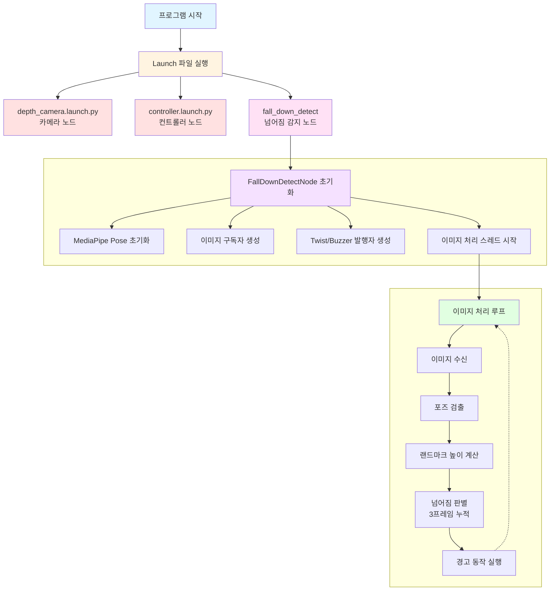
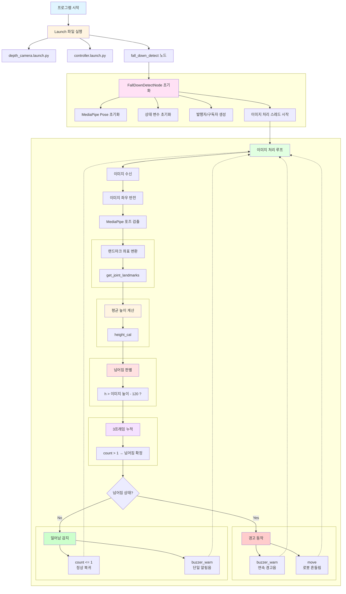
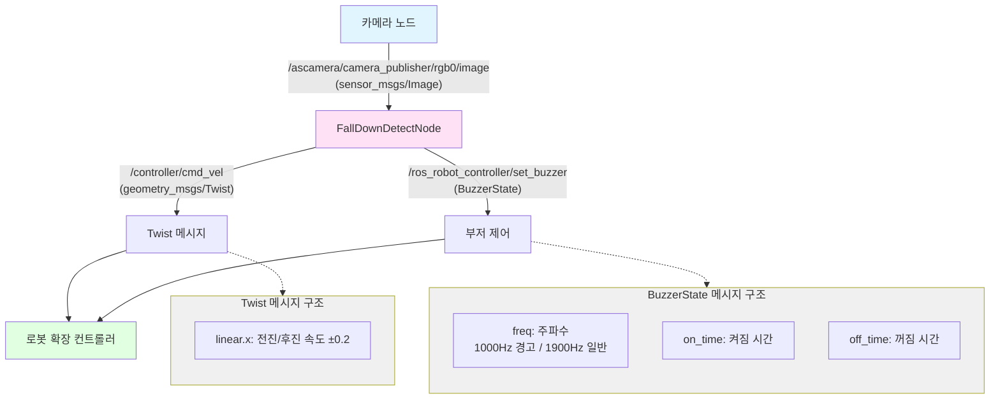

# Fall Down Detect

---

## 개요

> MediaPipe Pose와 ROS2를 활용하여 사람의 넘어짐(낙상)을 실시간으로 감지하고, 감지 시 로봇이 경고 동작과 부저 알림을 수행하는 프로젝트입니다. 신체 랜드마크의 평균 높이를 분석하여 넘어짐 여부를 판단합니다.
> 

**주요 기능**

- **포즈 검출**: MediaPipe Pose를 사용한 실시간 신체 랜드마크 검출
- **넘어짐 감지**: 신체 랜드마크 평균 높이 기반 낙상 판별
- **경고 동작**: 넘어짐 감지 시 로봇이 앞뒤로 흔들리는 동작 수행
- **부저 알림**: 넘어짐 감지 시 연속 부저 경고음 발생

## 동작 확인

1. MentorPi를 시작하고 VNC Viewer에 연결합니다.
2. **Terminator**에서 아래 명령어를 입력해 ROS 2관련 자동 실행 서비스를 중지합니다.
    
    ```bash
    ~/.stop_ros.sh
    ```
    
3. Fall Down Detect 기능을 활성화하기 위해 명령어를 입력합니다.
    
    ```bash
    ros2 launch example fall_down_detect.launch.py
    ```
    
4. 카메라 앞에서 넘어지는 동작을 수행하면:
    - 로봇이 앞뒤로 흔들리는 경고 동작 수행
    - 부저가 연속으로 경고음 발생
    - 일어나면 부저가 한 번 울리고 정상 상태로 복귀
5. 실습을 종료하려면 터미널에서 `Ctrl+C`를 누르거나 `q` 또는 `ESC` 키를 누릅니다.
6. **LXTerminal**에서 아래 명령어로 로봇 기능들을 다시 활성화하거나, 로봇을 재시작할 수 있습니다.
    
    ```bash
    sudo systemctl restart start_node.service
    ```

## 동작 원리

1. **이미지 수신**: ROS2를 통해 카메라 이미지를 구독
2. **포즈 검출**: MediaPipe Pose를 사용하여 신체 랜드마크 33개 검출
3. **높이 계산**: 모든 랜드마크의 Y 좌표 평균 계산
4. **넘어짐 판별**: 평균 높이가 임계값(이미지 하단 120px)을 초과하면 넘어짐으로 판단
5. **노이즈 필터링**: 3프레임 연속 분석으로 안정적인 감지
6. **경고 동작**: 넘어짐 확정 시 로봇 흔들림 + 부저 알림


## 프로그램 구조




# 주요 사용 기술

---

## 랜드마크 평균 높이 계산


### **평균 높이란?**

> 신체의 모든 랜드마크 Y 좌표의 평균값입니다. 사람이 서 있을 때보다 넘어졌을 때 Y 좌표 평균이 이미지 하단(값이 큼)에 위치하게 됩니다.
>

### **계산 방법**

```python
def height_cal(landmarks):
    y = []
    for i in landmarks:
        y.append(i[1])  # Y 좌표만 추출
    height = sum(y) / len(y)  # 평균 계산
    return height
```

- 모든 랜드마크의 Y 좌표를 수집
- 평균값 계산하여 반환
- 이미지 좌표계에서 Y값이 클수록 화면 아래쪽

### **넘어짐 판별 기준**

```python
# 이미지 높이에서 120px을 뺀 값이 임계값
if h > image.shape[:-2][0] - 120:
    self.fall_down_count.append(1)  # 넘어짐 감지
else:
    self.fall_down_count.append(0)  # 정상 상태
```

- **임계값**: `이미지 높이 - 120` 픽셀
- **넘어짐 조건**: 평균 높이가 임계값보다 크면 (화면 하단에 위치)
- **정상 조건**: 평균 높이가 임계값보다 작으면 (화면 상단/중앙에 위치)


# 코드 분석

---

## 1. Launch 파일 구조

### **launch_setup 함수**

```python
def launch_setup(context):
    ...
    # 카메라 launch 포함
    depth_camera_launch = IncludeLaunchDescription(
        PythonLaunchDescriptionSource(
            os.path.join(peripherals_package_path, 'launch/depth_camera.launch.py')),
    )
    
    # 컨트롤러 launch 포함
    controller_launch = IncludeLaunchDescription(
        PythonLaunchDescriptionSource(
            os.path.join(controller_package_path, 'launch/controller.launch.py')),
    )

    # Fall Down Detect 노드
    fall_down_detect_node = Node(
        package='example',
        executable='fall_down_detect',
        output='screen',
    )

    return [depth_camera_launch,
            controller_launch,
            fall_down_detect_node]
```

- **depth_camera_launch**: 카메라 노드 실행
- **controller_launch**: 로봇 컨트롤러 노드 실행
- **fall_down_detect_node**: 넘어짐 감지 노드 실행


## 2. FallDownDetectNode 클래스

### **노드 초기화**

```python
class FallDownDetectNode(Node):
    def __init__(self, name):
        rclpy.init()
        super().__init__(name, allow_undeclared_parameters=True,
                         automatically_declare_parameters_from_overrides=True)
        
        # MediaPipe Pose 초기화
        self.body_detector = mp_pose.Pose(
            static_image_mode=False,        # 비디오 스트림 모드
            min_tracking_confidence=0.7,    # 추적 신뢰도 임계값
            min_detection_confidence=0.7    # 검출 신뢰도 임계값
        )
        
        # 상태 변수 초기화
        self.fall_down_count = []    # 넘어짐 상태 누적
        self.move_finish = True      # 이동 완료 플래그
        self.stop_flag = False       # 정지 플래그
        
        # 발행자 생성
        self.mecanum_pub = self.create_publisher(Twist, '/controller/cmd_vel', 1)
        self.buzzer_pub = self.create_publisher(BuzzerState, '/ros_robot_controller/set_buzzer', 1)
        
        # 이미지 구독자 생성
        self.create_subscription(Image, '/ascamera/camera_publisher/rgb0/image',
                                 self.image_callback, 1)
```

- **주요 파라미터**
    - `min_detection_confidence=0.7`: 검출 신뢰도 70% 이상
    - `min_tracking_confidence=0.7`: 추적 신뢰도 70% 이상


### **이미지 콜백 함수**

```python
def image_callback(self, ros_image):
    cv_image = self.bridge.imgmsg_to_cv2(ros_image, "rgb8")
    rgb_image = np.array(cv_image, dtype=np.uint8)
    ...
    self.image_queue.put(rgb_image)
```


## 3. 랜드마크 좌표 변환

### **get_joint_landmarks 함수**

```python
def get_joint_landmarks(img, landmarks):
    """
    MediaPipe의 정규화된 좌표를 픽셀 좌표로 변환
    :param img: 이미지
    :param landmarks: 정규화된 랜드마크
    :return: 픽셀 좌표 배열
    """
    h, w, _ = img.shape
    landmarks = [(lm.x * w, lm.y * h) for lm in landmarks]
    return np.array(landmarks)
```


## 4. 높이 계산

### **height_cal 함수**

```python
def height_cal(landmarks):
    y = []
    for i in landmarks:
        y.append(i[1])  # 모든 랜드마크의 Y 좌표 수집
    height = sum(y) / len(y)  # 평균 계산
    return height
```

- 33개 랜드마크의 Y 좌표 평균 반환
- 값이 클수록 화면 하단에 위치 (넘어진 상태)


## 5. 이미지 처리 및 넘어짐 감지

### **image_proc 함수**

```python
def image_proc(self, image):
    image_flip = cv2.flip(cv2.cvtColor(image, cv2.COLOR_RGB2BGR), 1)
    results = self.body_detector.process(image)
    
    if results is not None and results.pose_landmarks:
        if self.move_finish:
            # 랜드마크 좌표 변환
            landmarks = get_joint_landmarks(image, results.pose_landmarks.landmark)
            
            # 평균 높이 계산
            h = height_cal(landmarks)
            
            # 넘어짐 판별 (이미지 높이 - 120px 기준)
            if h > image.shape[:-2][0] - 120:
                self.fall_down_count.append(1)  # 넘어짐
            else:
                self.fall_down_count.append(0)  # 정상
            
            # 3프레임 누적 후 판단
            if len(self.fall_down_count) == 3:
                count = sum(self.fall_down_count)
                self.fall_down_count = []
                
                if self.stop_flag:
                    # 이전에 넘어졌다가 일어난 경우
                    if count <= 1:
                        self.buzzer_warn()  # 알림음
                        self.stop_flag = False
                else:
                    # 넘어짐 확정 (3프레임 중 2프레임 이상)
                    if count > 1:
                        self.move_finish = False
                        threading.Thread(target=self.buzzer_warn).start()
                        threading.Thread(target=self.move).start()
        
        # 결과 이미지에 랜드마크 그리기
        result_image = cv2.cvtColor(image, cv2.COLOR_RGB2BGR)
        self.drawing.draw_landmarks(
            result_image,
            results.pose_landmarks,
            mp_pose.POSE_CONNECTIONS)
        return cv2.flip(result_image, 1)
    else:
        return image_flip
```

1. **이미지 전처리**: 좌우 반전 (거울 모드)
2. **포즈 검출**: MediaPipe Pose로 랜드마크 검출
3. **높이 계산**: 모든 랜드마크의 Y 좌표 평균
4. **넘어짐 판별**: 임계값(이미지 높이 - 120px) 비교
5. **프레임 누적**: 3프레임 동안 상태 누적
6. **경고 동작**: 넘어짐 확정 시 부저 + 로봇 흔들림


## 6. 경고 동작

### **move 함수**

```python
def move(self):
    for i in range(5):
        # 전진
        twist = Twist()
        twist.linear.x = 0.2
        self.mecanum_pub.publish(twist)
        time.sleep(0.2)
        
        # 후진
        twist = Twist()
        twist.linear.x = -0.2
        self.mecanum_pub.publish(twist)
        time.sleep(0.2)
    
    # 정지
    self.mecanum_pub.publish(Twist())
    self.stop_flag = True
    self.move_finish = True
```

- 전진/후진 5회 반복 (총 2초)
- 완료 후 플래그 설정


### **buzzer_warn 함수**

```python
def buzzer_warn(self):
    if not self.stop_flag:
        # 넘어진 상태: 연속 경고음
        while not self.stop_flag:
            msg = BuzzerState()
            msg.freq = 1000
            msg.on_time = 0.1
            msg.off_time = 0.1
            msg.repeat = 1
            self.buzzer_pub.publish(msg)
            time.sleep(0.2)
    else:
        # 일어난 상태: 단일 알림음
        msg = BuzzerState()
        msg.freq = 1900
        msg.on_time = 0.2
        msg.off_time = 0.01
        msg.repeat = 1
        self.buzzer_pub.publish(msg)
```


## 코드 흐름도



## 노드 간 통신 구조



