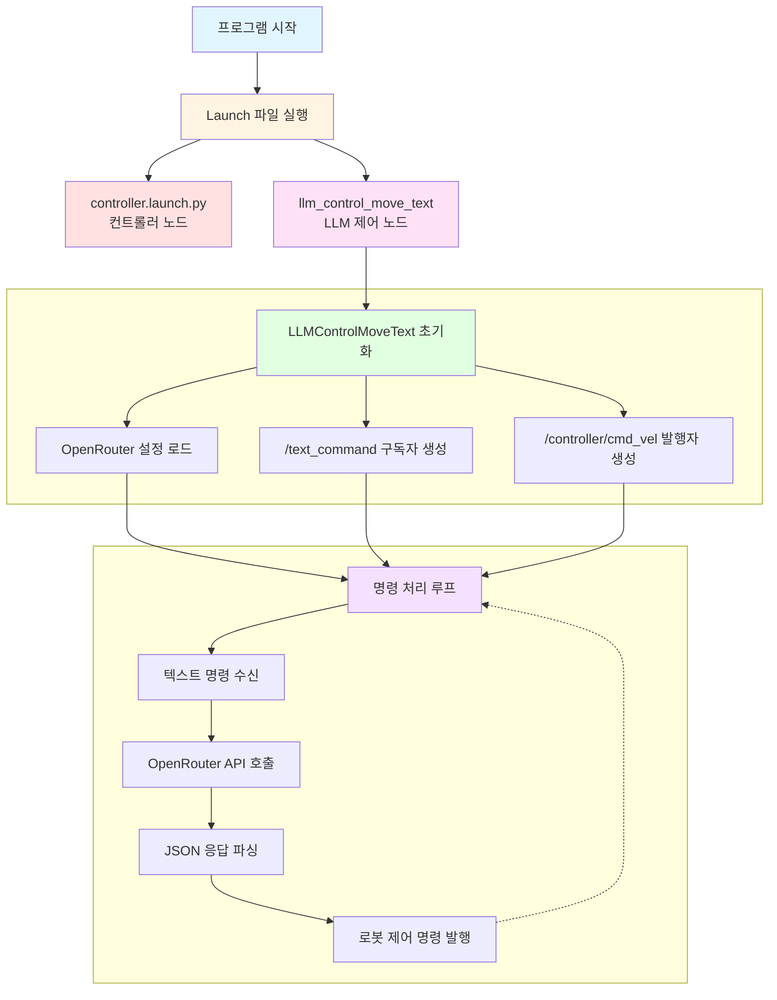
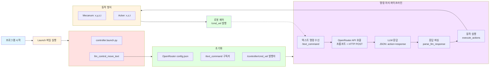
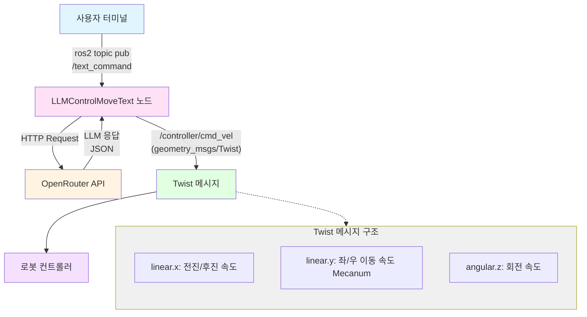

# LLM Control Move

---

## 개요

> OpenRouter API와 ROS2를 활용하여 자연어 텍스트 명령을 실시간으로 해석하고, 로봇의 주행을 제어하는 프로젝트입니다. 사용자가 “앞으로 2초간 전진해줘”와 같은 자연어 명령을 입력하면, LLM이 이를 해석하여 로봇 제어 명령으로 변환합니다.
> 

**주요 기능**

- **자연어 이해**: LLM을 사용한 자연어 명령 해석
- **동작 생성**: 텍스트 명령을 로봇 제어 JSON으로 변환
- **로봇 제어**: 생성된 명령에 따른 로봇 주행 제어 (전진/후진/좌/우/회전)
- **토픽 기반 입력**: ROS2 토픽을 통한 명령 수신

## 실습 환경 구성

1. `~/ros2_ws/src/large_models/large_models/openrouter/config.json` 파일을 확인하여 **api_key** 및 **llm_model**이 잘 정의돼 있는지 확인합니다.
2. 먼저 필요한 파일들을 생성하고 코드를 추가합니다.
    
    ```bash
    # LLM 제어 노드
    touch ~/ros2_ws/src/large_models/large_models/llm_control_move_text.py
    
    # Launch 파일
    touch ~/ros2_ws/src/large_models/launch/llm_control_move_text.launch.py
    ```
    <details>
    <summary>llm_control_move_text.py 코드</summary>
    <div markdown="1">

    ```python
    #!/usr/bin/env python3

    import os
    import json
    import time
    import rclpy
    import threading
    import requests
    from rclpy.node import Node
    from geometry_msgs.msg import Twist
    from std_msgs.msg import String
    from std_srvs.srv import Empty
    from rclpy.executors import MultiThreadedExecutor
    from rclpy.callback_groups import ReentrantCallbackGroup

    # Load OpenRouter config from source directory
    config_path = '/home/ubuntu/ros2_ws/src/large_models/large_models/openrouter/config.json'
    with open(config_path, 'r') as f:
        openrouter_config = json.load(f)

    OPENROUTER_API_KEY = openrouter_config.get('api_key', '')
    OPENROUTER_BASE_URL = openrouter_config.get('base_url', 'https://openrouter.ai/api/v1')
    OPENROUTER_MODEL = openrouter_config.get('llm_model', 'nvidia/nemotron-nano-9b-v2:free')
    GENERATION_CONFIG = openrouter_config.get('generation', {})

    # Get machine type
    MACHINE_TYPE = os.environ.get('MACHINE_TYPE', 'MentorPi_Acker')

    if MACHINE_TYPE == 'MentorPi_Mecanum':
        PROMPT = '''
    # Role Task
    You are a smart car that can control linear velocity in x and y directions (in m/s) and angular velocity in z direction (in rad/s), with t controlling time (in seconds). Generate corresponding commands based on input instructions.

    ## Requirements and Constraints
    1. Ensure speed ranges are correct:
    - Linear velocity: x, y ∈ [-1.0, 1.0] (negative values indicate opposite direction)
    - Angular velocity: z ∈ [-1.0, 1.0] (counterclockwise is positive, clockwise is negative)
    2. Execute multiple actions sequentially, outputting an action list containing multiple movement commands. Only add [0.0, 0.0, 0.0, 0.0] after the last action to ensure the car stops.
    3. Default values: x and y: 0.2, z: 1.0, t: 1.0
    4. For each action sequence, craft a concise (5-10 words), witty feedback message.
    5. Output only JSON results directly - no analysis or extra content.
    6. Format:
    {
    "action": [[x1, y1, z1, t1], [x2, y2, z2, t2], ..., [0.0, 0.0, 0.0, 0.0]],
    "response": "message"
    }

    ## Task Examples
    Input: Move forward for 2 seconds
    Output: {"action": [[0.2, 0.0, 0.0, 2.0], [0.0, 0.0, 0.0, 0.0]], "response": "Moving forward!"}
    Input: Move forward 1 meter
    Output: {"action": [[0.2, 0.0, 0.0, 5.0], [0.0, 0.0, 0.0, 0.0]], "response": "Roger that!"}
    '''
    else:
        PROMPT = '''
    ## Role Task
    You're a smart car controlled with: x for linear velocity (m/s), z for angular velocity (rad/s), and t for time (seconds).

    ## Requirements
    1. Speed range: Linear x ∈ [-1.0, 1.0], Angular z ∈ [-1.0, 1.0] (positive=counterclockwise)
    2. Output action list with [0.0, 0.0, 0.0] at the end to stop.
    3. Defaults: x=0.2, z=1.0, t=2.0
    4. When turning, x must not be 0.0
    5. Craft concise (5-10 words) witty feedback.
    6. Output JSON only:
    {
    "action": [[x1, z1, t1], [x2, z2, t2], ..., [0.0, 0.0, 0.0]],
    "response": "message"
    }

    ## Task Examples
    Input: Move forward for 2 seconds, then rotate clockwise for 1 second
    Output: {"action": [[0.2, 0.0, 2.0], [0.2, -1.0, 1.0], [0.0, 0.0, 0.0]], "response": "Forward then spin!"}
    Input: Move forward 1 meter
    Output: {"action": [[0.2, 0.0, 5.0], [0.0, 0.0, 0.0]], "response": "Alright!"}
    '''


    class LLMControlMoveText(Node):
        def __init__(self, name):
            rclpy.init()
            super().__init__(name)
            
            self.running = True
            self.processing = False
            self.mecanum_pub = self.create_publisher(Twist, '/controller/cmd_vel', 1)
            
            timer_cb_group = ReentrantCallbackGroup()
            self.callback_group = ReentrantCallbackGroup()
            
            # Subscribe to text command topic
            self.create_subscription(
                String, 
                '/text_command', 
                self.text_command_callback, 
                10,
                callback_group=self.callback_group
            )
            
            self.timer = self.create_timer(0.5, self.init_process, callback_group=timer_cb_group)

        def init_process(self):
            self.timer.cancel()
            self.get_logger().info('\033[1;32m%s\033[0m' % '========================================')
            self.get_logger().info('\033[1;32m%s\033[0m' % 'LLM Control Move (Text Input Mode)')
            self.get_logger().info('\033[1;32m%s\033[0m' % f'Using OpenRouter Model: {OPENROUTER_MODEL}')
            self.get_logger().info('\033[1;32m%s\033[0m' % f'Machine Type: {MACHINE_TYPE}')
            self.get_logger().info('\033[1;32m%s\033[0m' % '========================================')
            self.get_logger().info('\033[1;33m%s\033[0m' % 'Waiting for commands on /text_command topic...')
            self.get_logger().info('\033[1;33m%s\033[0m' % 'Use: ros2 topic pub -1 /text_command std_msgs/String "data: \'your command\'"')
            
            self.create_service(Empty, '~/init_finish', self.get_node_state)

        def get_node_state(self, request, response):
            return response

        def _truncate_for_log(self, text, limit=3000):
            if text is None:
                return ''
            text = str(text)
            if len(text) <= limit:
                return text
            return text[:limit] + '...<truncated>'

        def call_openrouter_api(self, user_input):
            """Call OpenRouter API with the user input"""
            headers = {
                'Authorization': f'Bearer {OPENROUTER_API_KEY}',
                'Content-Type': 'application/json',
            }
            
            data = {
                'model': OPENROUTER_MODEL,
                'messages': [
                    {'role': 'system', 'content': PROMPT},
                    {'role': 'user', 'content': user_input}
                ],
                'temperature': GENERATION_CONFIG.get('temperature', 0.2),
                'top_p': GENERATION_CONFIG.get('top_p', 0.9),
                'max_tokens': GENERATION_CONFIG.get('max_tokens', 512),
            }
            
            try:
                response = requests.post(
                    f'{OPENROUTER_BASE_URL}/chat/completions',
                    headers=headers,
                    json=data,
                    timeout=openrouter_config.get('http', {}).get('timeout_sec', 60)
                )
                self.get_logger().info(
                    f'OpenRouter HTTP {response.status_code} raw response: {self._truncate_for_log(response.text)}'
                )
                response.raise_for_status()
                result = response.json()
                self.get_logger().info(
                    'OpenRouter JSON response: '
                    f'{self._truncate_for_log(json.dumps(result, ensure_ascii=False))}'
                )
                return result['choices'][0]['message']['content']
            except Exception as e:
                self.get_logger().error(f'API call failed: {e}')
                return None

        def parse_llm_response(self, llm_result):
            """Parse the LLM response to extract action and response"""
            try:
                # Find JSON in response
                start_idx = llm_result.find('{')
                end_idx = llm_result.rfind('}') + 1
                if start_idx != -1 and end_idx > start_idx:
                    json_str = llm_result[start_idx:end_idx]
                    result = json.loads(json_str)
                    return result
            except json.JSONDecodeError as e:
                self.get_logger().error(f'JSON parse error: {e}')
            return None

        def execute_actions(self, action_list):
            """Execute the movement actions"""
            if MACHINE_TYPE == 'MentorPi_Mecanum':
                for action in action_list:
                    if len(action) >= 4:
                        msg_twist = Twist()
                        msg_twist.linear.x = float(action[0])
                        msg_twist.linear.y = float(action[1])
                        msg_twist.angular.z = float(action[2])
                        self.mecanum_pub.publish(msg_twist)
                        self.get_logger().info(f'Executing: x={action[0]}, y={action[1]}, z={action[2]}, t={action[3]}')
                        time.sleep(float(action[3]))
            else:
                for action in action_list:
                    if len(action) >= 3:
                        msg_twist = Twist()
                        msg_twist.linear.x = float(action[0])
                        msg_twist.angular.z = float(action[1])
                        self.mecanum_pub.publish(msg_twist)
                        self.get_logger().info(f'Executing: x={action[0]}, z={action[1]}, t={action[2]}')
                        time.sleep(float(action[2]))
            
            # Ensure stop
            self.mecanum_pub.publish(Twist())

        def text_command_callback(self, msg):
            """Callback for text command topic"""
            if self.processing:
                self.get_logger().warn('Already processing a command, please wait...')
                return
            
            user_input = msg.data.strip()
            if not user_input:
                return
            
            self.processing = True
            threading.Thread(target=self.process_command, args=(user_input,), daemon=True).start()

        def process_command(self, user_input):
            """Process the text command"""
            try:
                self.get_logger().info(f'Processing: "{user_input}"')
                
                # Call OpenRouter API
                llm_result = self.call_openrouter_api(user_input)
                
                if llm_result:
                    self.get_logger().info(f'LLM Response: {llm_result}')
                    
                    # Parse response
                    parsed = self.parse_llm_response(llm_result)
                    
                    if parsed and 'action' in parsed:
                        action_list = parsed.get('action', [])
                        response_text = parsed.get('response', '')
                        
                        self.get_logger().info(f'\033[1;32mResponse: {response_text}\033[0m')
                        
                        if action_list:
                            self.get_logger().info('Executing actions...')
                            self.execute_actions(action_list)
                            self.get_logger().info('Actions completed!')
                        else:
                            self.get_logger().warn('No actions to execute')
                    else:
                        self.get_logger().info(f'Response: {llm_result}')
                else:
                    self.get_logger().error('Failed to get response from LLM')
            finally:
                self.processing = False
                self.get_logger().info('\033[1;33mReady for next command on /text_command\033[0m')


    def main():
        node = LLMControlMoveText('llm_control_move_text')
        executor = MultiThreadedExecutor()
        executor.add_node(node)
        try:
            executor.spin()
        except KeyboardInterrupt:
            pass
        finally:
            node.destroy_node()


    if __name__ == "__main__":
        main()
    ```

    </div>
    </details>

    <details>
    <summary>llm_control_move_text.launch.py 코드</summary>
    <div markdown="1">

    ```python
    import os
    from ament_index_python.packages import get_package_share_directory

    from launch_ros.actions import Node
    from launch.substitutions import EnvironmentVariable
    from launch import LaunchDescription
    from launch.launch_description_sources import PythonLaunchDescriptionSource
    from launch.actions import IncludeLaunchDescription, ExecuteProcess, OpaqueFunction


    def launch_setup(context):
        machine_type = EnvironmentVariable('MACHINE_TYPE', default_value='MentorPi_Acker')

        log_machine_type = ExecuteProcess(
            cmd=['echo', 'MACHINE_TYPE is set to: ', machine_type],
            shell=True
        )

        controller_package_path = get_package_share_directory('controller')

        controller_launch = IncludeLaunchDescription(
            PythonLaunchDescriptionSource(
                os.path.join(controller_package_path, 'launch/controller.launch.py')),
        )

        llm_control_move_text_node = Node(
            package='large_models',
            executable='llm_control_move_text',
            output='screen',
            parameters=[{'machine_type': machine_type}]
        )

        return [
            log_machine_type,
            controller_launch,
            llm_control_move_text_node,
        ]


    def generate_launch_description():
        return LaunchDescription([
            OpaqueFunction(function=launch_setup)
        ])

    ```

    </div>
    </details>

3. `~/ros2_ws/src/large_models/setup.py` 파일을 열고 다음과 같이 수정합니다.
    
    ```python
    entry_points={
        'console_scripts': [
    			  ...
    			  
    			  # 아래 코드 추가
            **'llm_control_move_text = large_models.llm_control_move_text:main',
            
            ...**
        ],
    },
    ```
    
4. 아래 명령어로 패키지를 빌드합니다.
    
    ```bash
    cd ~/ros2_ws
    colcon build --symlink-install --packages-select large_models
    source install/local_setup.zsh
    ```

## 동작 확인

1. MentorPi를 시작하고 VNC Viewer에 연결합니다.
2. **Terminator**에서 아래 명령어를 입력해 ROS 2관련 자동 실행 서비스를 중지합니다.
    
    ```bash
    ~/.stop_ros.sh
    ```
    
3. LLM Control 기능을 활성화하기 위해 명령어를 입력합니다.
    
    ```bash
    ros2 launch large_models llm_control_move_text.launch.py
    ```
    
4. **새 터미널**을 열고 텍스트 명령을 전송합니다:
    
    ```bash
    # 전진 명령
    ros2 topic pub -1 /text_command std_msgs/String "data: '앞으로 3초간 전진 후 정지'"
    
    # 후진 명령
    ros2 topic pub -1 /text_command std_msgs/String "data: '엄청 느리게 후진 3초'"
    
    # 회전 명령
    ros2 topic pub -1 /text_command std_msgs/String "data: '제자리 회전 3초 해볼래?'"
    
    # 복합 명령
    ros2 topic pub -1 /text_command std_msgs/String "data: '2초간 전진 후 우회전 해'"
    ```
    
5. 실습을 종료하려면 launch 터미널에서 `Ctrl+C`를 누릅니다.
6. **LXTerminal**에서 아래 명령어로 로봇 기능들을 다시 활성화하거나, 로봇을 재시작할 수 있습니다.
    
    ```bash
    sudo systemctl restart start_node.service
    ```

```Plain text
[llm_control_move_text-7] [INFO] [1767082098.548195985] [llm_control_move_text]: Ready for next command on /text_command
[llm_control_move_text-7] [INFO] [1767082139.489038200] [llm_control_move_text]: Processing: "앞으로 3초간 전진 후 정지"
[llm_control_move_text-7] [INFO] [1767082144.223711231] [llm_control_move_text]: OpenRouter HTTP 200 raw response: 
[llm_control_move_text-7]          
[llm_control_move_text-7] 
[llm_control_move_text-7]          
[llm_control_move_text-7] 
[llm_control_move_text-7]          
[llm_control_move_text-7] 
[llm_control_move_text-7]          
[llm_control_move_text-7] 
[llm_control_move_text-7]          
[llm_control_move_text-7] 
[llm_control_move_text-7]          
[llm_control_move_text-7] 
[llm_control_move_text-7]          
[llm_control_move_text-7] 
[llm_control_move_text-7]          
[llm_control_move_text-7] 
[llm_control_move_text-7]          
[llm_control_move_text-7] 
[llm_control_move_text-7]          
[llm_control_move_text-7] {"id":"gen-1767082139-pD73VkVahAxTE1R4Oh6Y","provider":"Nvidia","model":"nvidia/nemotron-nano-9b-v2:free","object":"chat.completion","created":1767082139,"choices":[{"logprobs":null,"finish_reason":"stop","native_finish_reason":"stop","index":0,"message":{"role":"assistant","content":"{\"action\": [[0.2, 0.0, 0.0, 3.0], [0.0, 0.0, 0.0, 0.0]], \"response\": \"Zooming forward!\"}\n","refusal":null,"reasoning":"Okay, let's tackle this user request. The user wants the car to move forward for 3 seconds and then stop. \n\nFirst, I need to recall the requirements. The linear velocity in x and y should be between -1.0 and 1.0, and angular velocity z between -1.0 and 1.0. The default values are x=0.2, y=0.0, z=1.0, t=1.0. \n\nThe task is to move forward, which typically means increasing the x-direction velocity. Since the default x is 0.2, I should use that. The time for the movement is 3 seconds. So the first action should be [0.2, 0.0, 0.0, 3.0]. Then, after that, we need to stop, which is [0.0, 0.0, 0.0, 0.0].\n\nWait, but the example given for moving forward 1 meter used 0.2 velocity for 5 seconds. That makes sense because 0.2 m/s * 5s = 1m. So in this case, moving forward for 3 seconds at 0.2 m/s would cover 0.6 meters. But the user didn't specify distance, just time. So the command is correct as per the input.\n\nThe response should be a witty message. The example used \"Moving forward!\" and \"Roger that!\". Maybe something like \"Zooming ahead!\" or \"Forward in 3 seconds!\" but needs to be concise. \"Forward for 3 seconds!\" is straightforward but maybe \"Zooming forward!\" is more witty.\n\nSo the action list is [[0.2, 0.0, 0.0, 3.0], [0.0, 0.0, 0.0, 0.0]]. The response could be \"Zooming forward!\" or similar. Need to make sure the JSON is correctly formatted and the response is within 5-10 words.\n","reasoning_details":[{"format":"unknown","index":0,"type":"reasoning.text","text":"Okay, let's tackle this user request. The user wants the car to move forward for 3 seconds and then stop. \n\nFirst, I need to recall the requirements. The linear velocity in x and y should be between -1.0 and 1.0, and angular velocity z between -1.0 and 1.0. The default values are x=0.2, y=0.0, z=1.0, t=1.0. \n\nThe task is to move forward, which typically means increasing the x-direction velocity. Since the default x is 0.2, I should use that. The time for the movement is 3 seconds. So the first action should be [0.2, 0.0, 0.0, 3.0]. Then, after that, we need to stop, which is [0.0, 0.0, 0.0, 0.0].\n\nWait, but the example given for moving forward 1 meter used 0.2 velocity for 5 seconds. That makes sense because 0.2 m/s * 5s = 1m. So in this case, moving forward for 3 seconds at 0.2 m/s would cover 0.6 meters. But the user didn't specify distance, just time. So the command is correct as per the input.\n\nThe response should be a witty message. The example u...<truncated>
[llm_control_move_text-7] [INFO] [1767082144.224760682] [llm_control_move_text]: OpenRouter JSON response: {"id": "gen-1767082139-pD73VkVahAxTE1R4Oh6Y", "provider": "Nvidia", "model": "nvidia/nemotron-nano-9b-v2:free", "object": "chat.completion", "created": 1767082139, "choices": [{"logprobs": null, "finish_reason": "stop", "native_finish_reason": "stop", "index": 0, "message": {"role": "assistant", "content": "{\"action\": [[0.2, 0.0, 0.0, 3.0], [0.0, 0.0, 0.0, 0.0]], \"response\": \"Zooming forward!\"}\n", "refusal": null, "reasoning": "Okay, let's tackle this user request. The user wants the car to move forward for 3 seconds and then stop. \n\nFirst, I need to recall the requirements. The linear velocity in x and y should be between -1.0 and 1.0, and angular velocity z between -1.0 and 1.0. The default values are x=0.2, y=0.0, z=1.0, t=1.0. \n\nThe task is to move forward, which typically means increasing the x-direction velocity. Since the default x is 0.2, I should use that. The time for the movement is 3 seconds. So the first action should be [0.2, 0.0, 0.0, 3.0]. Then, after that, we need to stop, which is [0.0, 0.0, 0.0, 0.0].\n\nWait, but the example given for moving forward 1 meter used 0.2 velocity for 5 seconds. That makes sense because 0.2 m/s * 5s = 1m. So in this case, moving forward for 3 seconds at 0.2 m/s would cover 0.6 meters. But the user didn't specify distance, just time. So the command is correct as per the input.\n\nThe response should be a witty message. The example used \"Moving forward!\" and \"Roger that!\". Maybe something like \"Zooming ahead!\" or \"Forward in 3 seconds!\" but needs to be concise. \"Forward for 3 seconds!\" is straightforward but maybe \"Zooming forward!\" is more witty.\n\nSo the action list is [[0.2, 0.0, 0.0, 3.0], [0.0, 0.0, 0.0, 0.0]]. The response could be \"Zooming forward!\" or similar. Need to make sure the JSON is correctly formatted and the response is within 5-10 words.\n", "reasoning_details": [{"format": "unknown", "index": 0, "type": "reasoning.text", "text": "Okay, let's tackle this user request. The user wants the car to move forward for 3 seconds and then stop. \n\nFirst, I need to recall the requirements. The linear velocity in x and y should be between -1.0 and 1.0, and angular velocity z between -1.0 and 1.0. The default values are x=0.2, y=0.0, z=1.0, t=1.0. \n\nThe task is to move forward, which typically means increasing the x-direction velocity. Since the default x is 0.2, I should use that. The time for the movement is 3 seconds. So the first action should be [0.2, 0.0, 0.0, 3.0]. Then, after that, we need to stop, which is [0.0, 0.0, 0.0, 0.0].\n\nWait, but the example given for moving forward 1 meter used 0.2 velocity for 5 seconds. That makes sense because 0.2 m/s * 5s = 1m. So in this case, moving forward for 3 seconds at 0.2 m/s would cover 0.6 meters. But the user didn't specify distance, just time. So the command is correct as per the input.\n\nThe response should be a witty message. The example used \"Moving forward!\" and \"Roger that!\". Maybe something like \"Zoomin...<truncated>
[llm_control_move_text-7] [INFO] [1767082144.225864633] [llm_control_move_text]: LLM Response: {"action": [[0.2, 0.0, 0.0, 3.0], [0.0, 0.0, 0.0, 0.0]], "response": "Zooming forward!"}
[llm_control_move_text-7] 
[llm_control_move_text-7] [INFO] [1767082144.226492415] [llm_control_move_text]: Response: Zooming forward!
[llm_control_move_text-7] [INFO] [1767082144.227199234] [llm_control_move_text]: Executing actions...
[llm_control_move_text-7] [INFO] [1767082144.228033035] [llm_control_move_text]: Executing: x=0.2, y=0.0, z=0.0, t=3.0
[llm_control_move_text-7] [INFO] [1767082147.230860748] [llm_control_move_text]: Executing: x=0.0, y=0.0, z=0.0, t=0.0
[llm_control_move_text-7] [INFO] [1767082147.232386795] [llm_control_move_text]: Actions completed!
[llm_control_move_text-7] [INFO] [1767082147.233691210] [llm_control_move_text]: Ready for next command on /text_command
```

```Plain text
[llm_control_move_text-7] [INFO] [1767082263.579897871] [llm_control_move_text]: Ready for next command on /text_command
[llm_control_move_text-7] [INFO] [1767082267.895954168] [llm_control_move_text]: Processing: "제자리 회전 1바퀴"
[llm_control_move_text-7] [INFO] [1767082272.916945006] [llm_control_move_text]: OpenRouter HTTP 200 raw response: 
[llm_control_move_text-7]          
[llm_control_move_text-7] 
[llm_control_move_text-7]          
[llm_control_move_text-7] 
[llm_control_move_text-7]          
[llm_control_move_text-7] 
[llm_control_move_text-7]          
[llm_control_move_text-7] 
[llm_control_move_text-7]          
[llm_control_move_text-7] 
[llm_control_move_text-7]          
[llm_control_move_text-7] 
[llm_control_move_text-7]          
[llm_control_move_text-7] 
[llm_control_move_text-7]          
[llm_control_move_text-7] 
[llm_control_move_text-7]          
[llm_control_move_text-7] 
[llm_control_move_text-7]          
[llm_control_move_text-7] 
[llm_control_move_text-7]          
[llm_control_move_text-7] {"id":"gen-1767082268-YpcajlJxqJg5kaoH4nOK","provider":"Nvidia","model":"nvidia/nemotron-nano-9b-v2:free","object":"chat.completion","created":1767082268,"choices":[{"logprobs":null,"finish_reason":"stop","native_finish_reason":"stop","index":0,"message":{"role":"assistant","content":"{\"action\": [[0.0, 0.0, 1.0, 6.28], [0.0, 0.0, 0.0, 0.0]], \"response\": \"Spinning in place!\"}\n","refusal":null,"reasoning":"Okay, the user wants the car to rotate in place one full circle. Let me think about how to approach this.\n\nFirst, rotating in place means the linear velocities in x and y should be zero. The angular velocity z needs to be set. Since a full circle is 2π radians, and the default angular velocity is 1.0 rad/s, the time required would be 2π seconds. But wait, the default t is 1.0 second. So if I set z to 1.0, then t would need to be 2π to complete the rotation. However, the user might not want to wait that long. Alternatively, maybe adjust the angular velocity to make it faster. But the constraints say z must be between -1.0 and 1.0. So the maximum angular velocity is 1.0 rad/s. Therefore, to complete a full rotation (2π radians), the time needed is 2π / 1.0 ≈ 6.28 seconds. \n\nSo the action should be [0.0, 0.0, 1.0, 6.28], followed by stopping. The response should be something witty. Maybe \"Spinning in place!\" or \"One full circle done!\" \n\nWait, the example responses are concise. Let me check the examples. The first example's response is \"Moving forward!\" and the second is \"Roger that!\". So maybe \"Spinning around!\" or \"Full rotation complete!\" \n\nAlso, need to make sure the JSON is correctly formatted. The action array should have the rotation command and then the stop. The response should be a short message. \n\nSo the final action would be [[0.0, 0.0, 1.0, 6.28], [0.0, 0.0, 0.0, 0.0]], and the response could be \"Spinning in place!\" or similar. That should meet all the requirements.\n","reasoning_details":[{"format":"unknown","index":0,"type":"reasoning.text","text":"Okay, the user wants the car to rotate in place one full circle. Let me think about how to approach this.\n\nFirst, rotating in place means the linear velocities in x and y should be zero. The angular velocity z needs to be set. Since a full circle is 2π radians, and the default angular velocity is 1.0 rad/s, the time required would be 2π seconds. But wait, the default t is 1.0 second. So if I set z to 1.0, then t would need to be 2π to complete the rotation. However, the user might not want to wait that long. Alternatively, maybe adjust the angular velocity to make it faster. But the constraints say z must be between -1.0 and 1.0. So the maximum angular velocity is 1.0 rad/s. Therefore, to complete a full rotation (2π radians), the time needed is 2π / 1.0 ≈ 6.28 seconds. \n\nSo the action should be [0.0, 0.0, 1.0, 6.28], followed by stopping...<truncated>
[llm_control_move_text-7] [INFO] [1767082272.918042994] [llm_control_move_text]: OpenRouter JSON response: {"id": "gen-1767082268-YpcajlJxqJg5kaoH4nOK", "provider": "Nvidia", "model": "nvidia/nemotron-nano-9b-v2:free", "object": "chat.completion", "created": 1767082268, "choices": [{"logprobs": null, "finish_reason": "stop", "native_finish_reason": "stop", "index": 0, "message": {"role": "assistant", "content": "{\"action\": [[0.0, 0.0, 1.0, 6.28], [0.0, 0.0, 0.0, 0.0]], \"response\": \"Spinning in place!\"}\n", "refusal": null, "reasoning": "Okay, the user wants the car to rotate in place one full circle. Let me think about how to approach this.\n\nFirst, rotating in place means the linear velocities in x and y should be zero. The angular velocity z needs to be set. Since a full circle is 2π radians, and the default angular velocity is 1.0 rad/s, the time required would be 2π seconds. But wait, the default t is 1.0 second. So if I set z to 1.0, then t would need to be 2π to complete the rotation. However, the user might not want to wait that long. Alternatively, maybe adjust the angular velocity to make it faster. But the constraints say z must be between -1.0 and 1.0. So the maximum angular velocity is 1.0 rad/s. Therefore, to complete a full rotation (2π radians), the time needed is 2π / 1.0 ≈ 6.28 seconds. \n\nSo the action should be [0.0, 0.0, 1.0, 6.28], followed by stopping. The response should be something witty. Maybe \"Spinning in place!\" or \"One full circle done!\" \n\nWait, the example responses are concise. Let me check the examples. The first example's response is \"Moving forward!\" and the second is \"Roger that!\". So maybe \"Spinning around!\" or \"Full rotation complete!\" \n\nAlso, need to make sure the JSON is correctly formatted. The action array should have the rotation command and then the stop. The response should be a short message. \n\nSo the final action would be [[0.0, 0.0, 1.0, 6.28], [0.0, 0.0, 0.0, 0.0]], and the response could be \"Spinning in place!\" or similar. That should meet all the requirements.\n", "reasoning_details": [{"format": "unknown", "index": 0, "type": "reasoning.text", "text": "Okay, the user wants the car to rotate in place one full circle. Let me think about how to approach this.\n\nFirst, rotating in place means the linear velocities in x and y should be zero. The angular velocity z needs to be set. Since a full circle is 2π radians, and the default angular velocity is 1.0 rad/s, the time required would be 2π seconds. But wait, the default t is 1.0 second. So if I set z to 1.0, then t would need to be 2π to complete the rotation. However, the user might not want to wait that long. Alternatively, maybe adjust the angular velocity to make it faster. But the constraints say z must be between -1.0 and 1.0. So the maximum angular velocity is 1.0 rad/s. Therefore, to complete a full rotation (2π radians), the time needed is 2π / 1.0 ≈ 6.28 seconds. \n\nSo the action should be [0.0, 0.0, 1.0, 6.28], followed by stopping. The response should be something witty. Maybe \"Spinning in place!\" or \"One full ...<truncated>
[llm_control_move_text-7] [INFO] [1767082272.919236705] [llm_control_move_text]: LLM Response: {"action": [[0.0, 0.0, 1.0, 6.28], [0.0, 0.0, 0.0, 0.0]], "response": "Spinning in place!"}
[llm_control_move_text-7] 
[llm_control_move_text-7] [INFO] [1767082272.919909246] [llm_control_move_text]: Response: Spinning in place!
[llm_control_move_text-7] [INFO] [1767082272.920506842] [llm_control_move_text]: Executing actions...
[llm_control_move_text-7] [INFO] [1767082272.921303551] [llm_control_move_text]: Executing: x=0.0, y=0.0, z=1.0, t=6.28
[llm_control_move_text-7] [INFO] [1767082279.208681756] [llm_control_move_text]: Executing: x=0.0, y=0.0, z=0.0, t=0.0
[llm_control_move_text-7] [INFO] [1767082279.209704688] [llm_control_move_text]: Actions completed!
[llm_control_move_text-7] [INFO] [1767082279.210418971] [llm_control_move_text]: Ready for next command on /text_command

```

## 동작 원리

1. **명령 수신**: ROS2 `/text_command` 토픽을 통해 텍스트 명령 수신
2. **LLM API 호출**: OpenRouter API로 자연어 명령 전송
3. **응답 파싱**: LLM 응답에서 JSON 형식의 action 추출
4. **동작 실행**: action 리스트를 순차적으로 실행
5. **로봇 제어**: Twist 메시지를 `/controller/cmd_vel`로 발행

## 프로그램 구조



# 코드 분석

---

## 1. Launch 파일 구조

### **launch_setup 함수**

```python
def launch_setup(context):
    machine_type = EnvironmentVariable('MACHINE_TYPE', default_value='MentorPi_Acker')
    log_machine_type = ExecuteProcess(
        cmd=['echo', 'MACHINE_TYPE is set to: ', machine_type],
        shell=True    )
    controller_package_path = get_package_share_directory('controller')
    
    # 컨트롤러 launch 포함
    controller_launch = IncludeLaunchDescription(
        PythonLaunchDescriptionSource(
            os.path.join(controller_package_path, 'launch/controller.launch.py')),
    )
    
    # LLM 제어 노드
    llm_control_move_text_node = Node(
        package='large_models',
        executable='llm_control_move_text',
        output='screen',
        parameters=[{'machine_type': machine_type}]
    )
    return [
        log_machine_type,
        controller_launch,
        llm_control_move_text_node,
    ]
def generate_launch_description():
    return LaunchDescription([
        OpaqueFunction(function=launch_setup)
    ])
```

- **controller_launch**: 로봇 컨트롤러 노드 실행
- **llm_control_move_text_node**: LLM 작업 수행 노드 실행
- **기존 llm_control_move.launch.py와의 차이점**
    
    
    | 항목 | 기존 (음성 기반) | 신규 (텍스트 기반) |
    | --- | --- | --- |
    | vocal_detect | 포함 | 제외 |
    | tts_node | 포함 | 제외 |
    | agent_process | 포함 | 제외 |
    | controller | 포함 | 포함 |
    | 입력 방식 | 마이크 | ROS2 토픽 |

## 2. LLMControlMoveText 클래스

### **노드 초기화**

```python
class LLMControlMoveText(Node):
    def __init__(self, name):
        rclpy.init()
        super().__init__(name)
        
        self.running = True
        self.processing = False  # 명령 처리 중 플래그
        self.mecanum_pub = self.create_publisher(Twist, '/controller/cmd_vel', 1)
        
        timer_cb_group = ReentrantCallbackGroup()
        self.callback_group = ReentrantCallbackGroup()
        
        # 텍스트 명령 토픽 구독
        self.create_subscription(
            String, 
            '/text_command', 
            self.text_command_callback, 
            10,
            callback_group=self.callback_group
        )
        
        self.timer = self.create_timer(0.5, self.init_process, callback_group=timer_cb_group)
```

- **processing**: 중복 명령 방지를 위한 플래그
- **/text_command**: 텍스트 명령 수신 토픽
- **/controller/cmd_vel**: 로봇 제어 명령 발행 토픽


## 3. 프롬프트 설계

### **M1 모델**

```python
if MACHINE_TYPE == 'MentorPi_Mecanum':
    PROMPT = '''
# Role Task
You are a smart car that can control linear velocity in x and y directions (in m/s) 
and angular velocity in z direction (in rad/s), with t controlling time (in seconds).

## Requirements and Constraints
1. Speed ranges: x, y ∈ [-1.0, 1.0], z ∈ [-1.0, 1.0]
2. Output action list with [0.0, 0.0, 0.0, 0.0] at the end to stop.
3. Default values: x=0.2, y=0.2, z=1.0, t=1.0
4. Output JSON only:
{
  "action": [[x1, y1, z1, t1], [x2, y2, z2, t2], ..., [0.0, 0.0, 0.0, 0.0]],
  "response": "message"
}

## Task Examples
Input: Move forward for 2 seconds
Output: {"action": [[0.2, 0.0, 0.0, 2.0], [0.0, 0.0, 0.0, 0.0]], "response": "Moving forward!"}
'''
```

### **A1 모델**

```python
else:
    PROMPT = '''
## Role Task
You're a smart car controlled with: x for linear velocity (m/s), 
z for angular velocity (rad/s), and t for time (seconds).

## Requirements
1. Speed range: x ∈ [-1.0, 1.0], z ∈ [-1.0, 1.0]
2. Output action list with [0.0, 0.0, 0.0] at the end to stop.
3. Defaults: x=0.2, z=1.0, t=2.0
4. When turning, x must not be 0.0
5. Output JSON only:
{
  "action": [[x1, z1, t1], [x2, z2, t2], ..., [0.0, 0.0, 0.0]],
  "response": "message"
}
'''
```

| 로봇 타입 | action 형식 | 설명 |
| --- | --- | --- |
| M1 | [x, y, z, t] | x: 전후진, y: 좌우이동, z: 회전, t: 시간 |
| A1 | [x, z, t] | x: 전후진, z: 조향, t: 시간 |

## 4. OpenRouter API 호출
### **call_openrouter_api 함수**

```python
def call_openrouter_api(self, user_input):
    """OpenRouter API를 호출하여 LLM 응답 획득"""
    headers = {
        'Authorization': f'Bearer {OPENROUTER_API_KEY}',
        'Content-Type': 'application/json',
    }
    
    data = {
        'model': OPENROUTER_MODEL,
        'messages': [
            {'role': 'system', 'content': PROMPT},
            {'role': 'user', 'content': user_input}
        ],
        'temperature': GENERATION_CONFIG.get('temperature', 0.2),
        'top_p': GENERATION_CONFIG.get('top_p', 0.9),
        'max_tokens': GENERATION_CONFIG.get('max_tokens', 512),
    }
    
    try:
        response = requests.post(
            f'{OPENROUTER_BASE_URL}/chat/completions',
            headers=headers,
            json=data,
            timeout=openrouter_config.get('http', {}).get('timeout_sec', 60)
        )
        response.raise_for_status()
        result = response.json()
        return result['choices'][0]['message']['content']
    except Exception as e:
        self.get_logger().error(f'API call failed: {e}')
        return None
```

## 5. 응답 파싱 및 실행

### **parse_llm_response 함수**

```python
def parse_llm_response(self, llm_result):
    """LLM 응답에서 JSON 추출"""
    try:
        start_idx = llm_result.find('{')
        end_idx = llm_result.rfind('}') + 1
        if start_idx != -1 and end_idx > start_idx:
            json_str = llm_result[start_idx:end_idx]
            result = json.loads(json_str)
            return result
    except json.JSONDecodeError as e:
        self.get_logger().error(f'JSON parse error: {e}')
    return None
```

### **execute_actions 함수**

```python
def execute_actions(self, action_list):
    """동작 리스트를 순차적으로 실행"""
    if MACHINE_TYPE == 'MentorPi_Mecanum':
        for action in action_list:
            if len(action) >= 4:
                msg_twist = Twist()
                msg_twist.linear.x = float(action[0])   # 전후진
                msg_twist.linear.y = float(action[1])   # 좌우이동
                msg_twist.angular.z = float(action[2])  # 회전
                self.mecanum_pub.publish(msg_twist)
                self.get_logger().info(f'Executing: x={action[0]}, y={action[1]}, z={action[2]}, t={action[3]}')
                time.sleep(float(action[3]))  # 지정된 시간만큼 실행
    else:
        for action in action_list:
            if len(action) >= 3:
                msg_twist = Twist()
                msg_twist.linear.x = float(action[0])   # 전후진
                msg_twist.angular.z = float(action[1])  # 조향
                self.mecanum_pub.publish(msg_twist)
                self.get_logger().info(f'Executing: x={action[0]}, z={action[1]}, t={action[2]}')
                time.sleep(float(action[2]))
    
    # 정지 명령
    self.mecanum_pub.publish(Twist())
```

## 6. 토픽 콜백 처리

### **text_command_callback 함수**

```python
def text_command_callback(self, msg):
    """텍스트 명령 토픽 콜백"""
    if self.processing:
        self.get_logger().warn('Already processing a command, please wait...')
        return
    
    user_input = msg.data.strip()
    if not user_input:
        return
    
    self.processing = True
    threading.Thread(target=self.process_command, args=(user_input,), daemon=True).start()
```

### **process_command 함수**

```python
def process_command(self, user_input):
    """명령 처리 메인 로직"""
    try:
        self.get_logger().info(f'Processing: "{user_input}"')
        
        # 1. OpenRouter API 호출
        llm_result = self.call_openrouter_api(user_input)
        
        if llm_result:
            self.get_logger().info(f'LLM Response: {llm_result}')
            
            # 2. 응답 파싱
            parsed = self.parse_llm_response(llm_result)
            
            if parsed and 'action' in parsed:
                action_list = parsed.get('action', [])
                response_text = parsed.get('response', '')
                
                self.get_logger().info(f'Response: {response_text}')
                
                # 3. 동작 실행
                if action_list:
                    self.get_logger().info('Executing actions...')
                    self.execute_actions(action_list)
                    self.get_logger().info('Actions completed!')
    finally:
        self.processing = False
        self.get_logger().info('Ready for next command on /text_command')
```

## 코드 흐름도



## 노드 간 통신 구조

