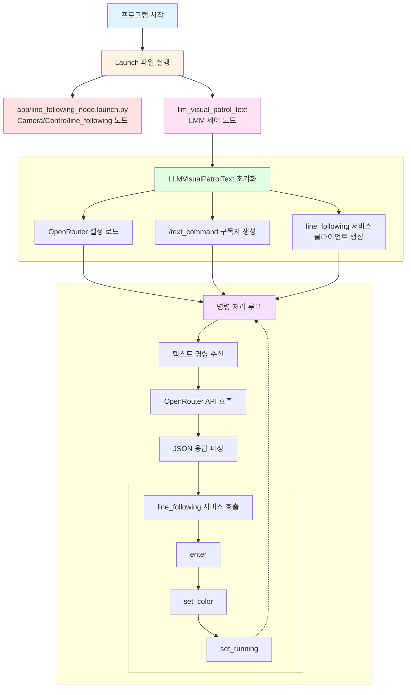
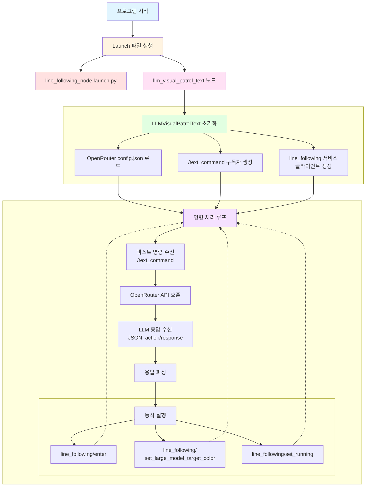
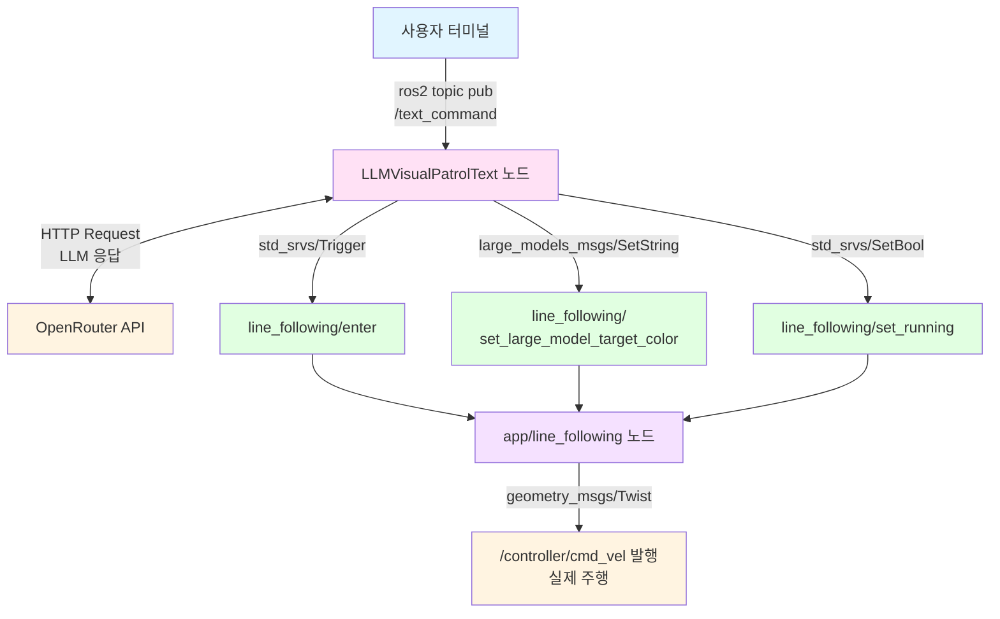

# LMM Visual Patrol

---

## 개요

> OpenRouter API와 ROS2를 활용하여 자연어 텍스트 명령을 실시간으로 해석하고, 로봇의 Line Following 기능을 제어하는 프로젝트입니다. 사용자가 “검정색 라인을 따라가”와 같은 자연어 명령을 입력하면, LMM/LLM이 이를 해석하여 라인 팔로잉을 시작/정지하는 서비스 호출로 변환합니다.
> 

**주요 기능**

- **자연어 이해**: LMM/LLM을 사용한 자연어 명령 해석
- **동작 생성**: 텍스트 명령을 `line_following('black')` 같은 함수 호출(JSON)로 변환
- **라인 팔로잉 실행**: `app` 패키지의 `line_following` 노드 서비스를 호출하여 실제 라인 추적 수행
- **토픽 기반 입력**: ROS2 토픽(`/text_command`)을 통한 명령 수신

## 실습 환경 구성

1. `/home/ubuntu/ros2_ws/src/large_models/large_models/openrouter/config.json` 파일을 확인하여 **api_key** 및 **llm_model**이 잘 정의돼 있는지 확인합니다.
2. 먼저 필요한 파일들을 생성하고 코드를 추가합니다.
    
    ```bash
    # LMM 제어 노드
    touch /home/ubuntu/ros2_ws/src/large_models/large_models/llm_visual_patrol_text.py
    
    # Launch 파일
    touch /home/ubuntu/ros2_ws/src/large_models/launch/llm_visual_patrol_text.launch.py
    ```

    <details>
    <summary>llm_visual_patrol_text.py 코드</summary>
    <div markdown="1">

    ```python
    #!/usr/bin/env python3

    import os
    import re
    import json
    import time
    import rclpy
    import threading
    import requests
    from rclpy.node import Node
    from std_msgs.msg import String, Bool
    from std_srvs.srv import Trigger, SetBool
    from geometry_msgs.msg import Twist
    from rclpy.executors import MultiThreadedExecutor
    from rclpy.callback_groups import ReentrantCallbackGroup
    from large_models_msgs.srv import SetString
    from ros_robot_controller_msgs.msg import RGBStates

    # Load OpenRouter config from source directory
    config_path = '/home/ubuntu/ros2_ws/src/large_models/large_models/openrouter/config.json'
    with open(config_path, 'r') as f:
        openrouter_config = json.load(f)

    OPENROUTER_API_KEY = openrouter_config.get('api_key', '')
    OPENROUTER_BASE_URL = openrouter_config.get('base_url', 'https://openrouter.ai/api/v1')
    OPENROUTER_MODEL = openrouter_config.get('llm_model', 'nvidia/nemotron-nano-9b-v2:free')
    GENERATION_CONFIG = openrouter_config.get('generation', {})

    PROMPT = '''
    # Role
    You are an intelligent vision Mecanum wheel car that needs to generate corresponding JSON instructions based on input commands.

    ## Requirements and Constraints
    1. Based on the input action description, find the corresponding command in the action function library and output the matching instruction.
    2. Craft a concise (10-30 words), witty and varied feedback message for each action sequence to make the interaction more engaging.
    3. Output only the JSON result directly - no analysis or extra content.
    4. Format: {"action":["xx"], "response":"xx"}

    ## Available Functions:
    - line_following('color') - Follow a line of specified color (black, red, green, blue, yellow)
    - stop() - Stop all actions

    ## Structure Requirements:
    - The "action" key contains an array of function name strings in execution order. Output [] when no matching action is found.
    - The "response" key contains a carefully crafted short reply that perfectly matches the word count and style requirements.

    ## Task Examples:
    Input: Follow the black line forward
    Output: {"action":["line_following('black')"],"response":"Tracking black line, smooth sailing ahead!"}

    Input: Follow the red line at your feet
    Output: {"action":["line_following('red')"], "response":"Red line tracking activated, walking the red carpet!"}

    Input: Stop following
    Output: {"action":["stop()"], "response":"Stopping now, taking a break!"}

    Input: 검은색 라인을 따라가
    Output: {"action":["line_following('black')"], "response":"블랙라인 추적 시작!"}
    '''


    class LLMVisualPatrolText(Node):
        def __init__(self, name):
            rclpy.init()
            super().__init__(name)
            
            self.running = True
            self.processing = False
            self.pattern_following = r"line_following\(['\"]?(.*?)['\"]?\)"
            self.pattern_stop = r"stop\(\)"
            
            self.mecanum_pub = self.create_publisher(Twist, '/controller/cmd_vel', 1)
            self.rgb_pub = self.create_publisher(RGBStates, 'ros_robot_controller/set_rgb', 10)
            
            self.callback_group = ReentrantCallbackGroup()
            
            # Subscribe to text command topic
            self.create_subscription(
                String,
                '/text_command',
                self.text_command_callback,
                10,
                callback_group=self.callback_group
            )
            
            # line_following service clients
            self.enter_client_line_following = self.create_client(Trigger, 'line_following/enter')
            self.start_client_line_following = self.create_client(SetBool, 'line_following/set_running')
            self.set_target_client_line_following = self.create_client(SetString, 'line_following/set_large_model_target_color')
            
            timer_cb_group = ReentrantCallbackGroup()
            self.timer = self.create_timer(0.5, self.init_process, callback_group=timer_cb_group)

        def init_process(self):
            self.timer.cancel()
            
            # Check for services (non-blocking)
            self.get_logger().info('Checking for line_following services...')
            if not self.enter_client_line_following.service_is_ready():
                self.get_logger().warn('line_following/enter service not ready yet')
            if not self.start_client_line_following.service_is_ready():
                self.get_logger().warn('line_following/set_running service not ready yet')
            if not self.set_target_client_line_following.service_is_ready():
                self.get_logger().warn('line_following/set_large_model_target_color service not ready yet')
            
            self.mecanum_pub.publish(Twist())
            
            self.get_logger().info('\033[1;32m%s\033[0m' % '========================================')
            self.get_logger().info('\033[1;32m%s\033[0m' % 'LLM Visual Patrol (Text Input Mode)')
            self.get_logger().info('\033[1;32m%s\033[0m' % f'Using OpenRouter Model: {OPENROUTER_MODEL}')
            self.get_logger().info('\033[1;32m%s\033[0m' % '========================================')
            self.get_logger().info('\033[1;33m%s\033[0m' % 'Waiting for commands on /text_command topic...')
            self.get_logger().info('\033[1;33m%s\033[0m' % 'Example: ros2 topic pub -1 /text_command std_msgs/String "data: \'follow the black line\'"')
            
            self.create_service(Trigger, '~/init_finish', self.get_node_state)
            self.get_logger().info('\033[1;32m%s\033[0m' % 'Ready!')

        def _truncate_for_log(self, text, limit=3000):
            if text is None:
                return ''
            text = str(text)
            if len(text) <= limit:
                return text
            return text[:limit] + '...<truncated>'

        def get_node_state(self, request, response):
            response.success = True
            return response

        def send_request(self, client, msg):
            """Send service request and wait for response"""
            future = client.call_async(msg)
            while rclpy.ok():
                if future.done():
                    try:
                        return future.result()
                    except Exception as e:
                        self.get_logger().error(f'Service call failed: {e}')
                        return None
                time.sleep(0.01)
            return None

        def call_openrouter_api(self, user_input):
            """Call OpenRouter API with the user input"""
            headers = {
                'Authorization': f'Bearer {OPENROUTER_API_KEY}',
                'Content-Type': 'application/json',
            }
            
            data = {
                'model': OPENROUTER_MODEL,
                'messages': [
                    {'role': 'system', 'content': PROMPT},
                    {'role': 'user', 'content': user_input}
                ],
                'temperature': GENERATION_CONFIG.get('temperature', 0.2),
                'top_p': GENERATION_CONFIG.get('top_p', 0.9),
                'max_tokens': GENERATION_CONFIG.get('max_tokens', 512),
            }
            
            try:
                response = requests.post(
                    f'{OPENROUTER_BASE_URL}/chat/completions',
                    headers=headers,
                    json=data,
                    timeout=openrouter_config.get('http', {}).get('timeout_sec', 60)
                )
                self.get_logger().info(
                    f'OpenRouter HTTP {response.status_code} raw response: {self._truncate_for_log(response.text)}'
                )
                response.raise_for_status()
                result = response.json()
                self.get_logger().info(
                    'OpenRouter JSON response: '
                    f'{self._truncate_for_log(json.dumps(result, ensure_ascii=False))}'
                )
                return result['choices'][0]['message']['content']
            except Exception as e:
                self.get_logger().error(f'API call failed: {e}')
                return None

        def parse_llm_response(self, llm_result):
            """Parse the LLM response to extract action and response"""
            try:
                start_idx = llm_result.find('{')
                end_idx = llm_result.rfind('}') + 1
                if start_idx != -1 and end_idx > start_idx:
                    json_str = llm_result[start_idx:end_idx]
                    result = json.loads(json_str)
                    return result
            except json.JSONDecodeError as e:
                self.get_logger().error(f'JSON parse error: {e}')
            return None

        def execute_actions(self, action_list):
            """Execute the action list"""
            for action in action_list:
                self.get_logger().info(f'Executing action: {action}')
                
                # Check for line_following action
                match_following = re.search(self.pattern_following, action)
                if match_following:
                    color = match_following.group(1)
                    self.get_logger().info(f'Starting line following with color: {color}')
                    
                    # Enter line following mode
                    self.send_request(self.enter_client_line_following, Trigger.Request())
                    
                    # Set target color
                    msg = SetString.Request()
                    msg.data = color
                    self.send_request(self.set_target_client_line_following, msg)
                    
                    # Start line following
                    msg = SetBool.Request()
                    msg.data = True
                    self.send_request(self.start_client_line_following, msg)
                    
                    self.get_logger().info(f'Line following started for color: {color}')
                    continue
                
                # Check for stop action
                match_stop = re.search(self.pattern_stop, action)
                if match_stop:
                    self.get_logger().info('Stopping line following')
                    
                    # Stop line following
                    msg = SetBool.Request()
                    msg.data = False
                    self.send_request(self.start_client_line_following, msg)
                    
                    # Stop robot
                    self.mecanum_pub.publish(Twist())
                    self.get_logger().info('Stopped')
                    continue
                
                self.get_logger().warn(f'Unknown action: {action}')

        def text_command_callback(self, msg):
            """Callback for text command topic"""
            self.get_logger().info(f'Received text command: {msg.data}')

            if self.processing:
                self.get_logger().warn('Already processing a command, please wait...')
                return
            
            user_input = msg.data.strip()
            if not user_input:
                return
            
            self.processing = True
            threading.Thread(target=self.process_command, args=(user_input,), daemon=True).start()

        def process_command(self, user_input):
            """Process the text command"""
            try:
                self.get_logger().info(f'Processing: "{user_input}"')
                
                # Call OpenRouter API
                llm_result = self.call_openrouter_api(user_input)
                
                if llm_result:
                    self.get_logger().info(f'LLM Response: {llm_result}')
                    
                    # Parse response
                    parsed = self.parse_llm_response(llm_result)
                    
                    if parsed and 'action' in parsed:
                        action_list = parsed.get('action', [])
                        response_text = parsed.get('response', '')
                        
                        self.get_logger().info(f'\033[1;32mResponse: {response_text}\033[0m')
                        
                        if action_list:
                            self.get_logger().info('Executing actions...')
                            self.execute_actions(action_list)
                            self.get_logger().info('Actions completed!')
                        else:
                            self.get_logger().warn('No actions to execute')
                    else:
                        self.get_logger().info(f'Response: {llm_result}')
                else:
                    self.get_logger().error('Failed to get response from LLM')
            finally:
                self.processing = False
                self.get_logger().info('\033[1;33mReady for next command on /text_command\033[0m')


    def main():
        node = LLMVisualPatrolText('llm_visual_patrol_text')
        executor = MultiThreadedExecutor()
        executor.add_node(node)
        try:
            executor.spin()
        except KeyboardInterrupt:
            pass
        finally:
            node.destroy_node()


    if __name__ == "__main__":
        main()
    ```

    </div>
    </details>

    <details>
    <summary>llm_visual_patrol_text.launch.py 코드</summary>
    <div markdown="1">

    ```python
    import os
    from ament_index_python.packages import get_package_share_directory

    from launch_ros.actions import Node
    from launch import LaunchDescription
    from launch.launch_description_sources import PythonLaunchDescriptionSource
    from launch.actions import IncludeLaunchDescription, OpaqueFunction


    def launch_setup(context):
        app_package_path = get_package_share_directory('app')

        # Line following node (includes camera and controller)
        line_following_node_launch = IncludeLaunchDescription(
            PythonLaunchDescriptionSource(
                os.path.join(app_package_path, 'launch/line_following_node.launch.py')),
            launch_arguments={
                'debug': 'true',
            }.items(),
        )

        # LLM Visual Patrol Text node
        llm_visual_patrol_text_node = Node(
            package='large_models',
            executable='llm_visual_patrol_text',
            output='screen',
        )

        return [
            line_following_node_launch,
            llm_visual_patrol_text_node,
        ]


    def generate_launch_description():
        return LaunchDescription([
            OpaqueFunction(function=launch_setup)
        ])

    ```

    </div>
    </details>

3. `/home/ubuntu/ros2_ws/src/large_models/setup.py` 파일을 열고 다음과 같이 수정합니다.
    
    ```python
    entry_points={
        'console_scripts': [
            ...
    
            # 아래 코드 추가
            'llm_visual_patrol_text = large_models.llm_visual_patrol_text:main',
    
            ...
        ],
    },
    ```
    
4. 아래 명령어로 패키지를 빌드합니다.
    
    ```bash
    cd ~/ros2_ws
    colcon build --symlink-install --packages-select large_models
    source /home/ubuntu/ros2_ws/install/local_setup.zsh
    ```
## 동작 확인

1. MentorPi를 시작하고 VNC Viewer에 연결합니다.
2. **Terminator**에서 아래 명령어를 입력해 ROS 2관련 자동 실행 서비스를 중지합니다.
    
    ```bash
    ~/.stop_ros.sh
    ```
    
3. LMM 기반 라인 팔로워 기능을 활성화하기 위해 명령어를 입력합니다.
    
    ```bash
    ros2 launch large_models llm_visual_patrol_text.launch.py
    ```
    
4. **새 터미널**을 열고 텍스트 명령을 전송합니다.
    
    ```bash
    # 검정색 라인 따라가기
    ros2 topic pub -1 /text_command std_msgs/String "data: '검정색 라인을 따라가'"
    
    # 빨간색 라인 따라가기
    ros2 topic pub -1 /text_command std_msgs/String "data: '빨간색 라인을 따라가'"
    
    # 정지
    ros2 topic pub -1 /text_command std_msgs/String "data: 'stop'"
    ```
    
5. 실습을 종료하려면 launch 터미널에서 `Ctrl+C`를 누릅니다.
6. **LXTerminal**에서 아래 명령어로 로봇 기능들을 다시 활성화하거나, 로봇을 재시작할 수 있습니다.
    
    ```bash
    sudo systemctl restart start_node.service
    ```

## 동작 원리

1. **명령 수신**: ROS2 `/text_command` 토픽으로 텍스트 명령을 수신
2. **LMM/LLM API 호출**: OpenRouter API로 자연어 명령을 전송
3. **응답 파싱**: LLM 응답에서 JSON 형식의 `action`을 추출
4. **서비스 호출**
    
    `line_following/enter` → `line_following/set_large_model_target_color` → `line_following/set_running` 순서로 호출
    
5. **라인 추적 수행**: `app` 패키지의 `line_following` 노드가 카메라 이미지에서 라인을 검출하고 주행을 제어
6. **색상 범위 적용(검정색 예시):** `black` 같은 색상 이름은 LAB 임계값(min/max)으로 변환되어 마스크 생성에 사용
    - 라인 팔로잉 색상 임계값은 `/home/ubuntu/software/lab_tool/lab_config.yaml`에서 관리
        
        ```python
        lab_file_path = '/home/ubuntu/software/lab_tool/lab_config.yaml'
        ```
        
    - 즉, “검정색 라인을 따라가”는 최종적으로 `lab_config.yaml`의 `black` 범위를 이용해 영상에서 검정 라인만 분리
        
        ```python
        self.lab_data = yaml_handle.get_yaml_data(yaml_handle.lab_file_path)
        color_data = self.lab_data['lab'][camera_type]['black']
        min_color = color_data['min']
        max_color = color_data['max']
        mask = cv2.inRange(img_blur, tuple(min_color), tuple(max_color))
        ```


## 프로그램 구조



# 코드 분석

---

## 1. Launch 파일 구조

### **launch_setup 함수**

> 기존 라인 팔로잉 스택(`app`)을 포함하고, 위에 자연어 명령 인터페이스(LLM 제어 노드)를 덧씌우는 형태
> 

```python
def launch_setup(context):
    app_package_path = get_package_share_directory('app')

    line_following_node_launch = IncludeLaunchDescription(
        PythonLaunchDescriptionSource(
            os.path.join(app_package_path, 'launch/line_following_node.launch.py')),
        launch_arguments={
            'debug': 'true',
        }.items(),
    )

    llm_visual_patrol_text_node = Node(
        package='large_models',
        executable='llm_visual_patrol_text',
        output='screen',
    )

    return [
        line_following_node_launch,
        llm_visual_patrol_text_node,
    ]
```

- **line_following_node_launch**: line following 노드 실행
- **llm_visual_patrol_text_node**: LLM 작업 수행 노드 실행

## 2. LLMVisualPatrolText 클래스

### **노드 초기화**

> 영상 처리를 직접 하지 않고, `line_following` 노드를 서비스 호출로 제어하는 역할만 담당
> 

```python
class LLMVisualPatrolText(Node):
    def __init__(self, name):
        rclpy.init()
        super().__init__(name)

        self.processing = False

        self.create_subscription(
            String,
            '/text_command',
            self.text_command_callback,
            10,
            callback_group=self.callback_group
        )

        self.enter_client_line_following = self.create_client(Trigger, 'line_following/enter')
        self.start_client_line_following = self.create_client(SetBool, 'line_following/set_running')
        self.set_target_client_line_following = self.create_client(SetString, 'line_following/set_large_model_target_color')
```

## 3. 프롬프트 설계

```python
PROMPT = '''
# Role
You are an intelligent vision Mecanum wheel car that needs to generate corresponding JSON instructions based on input commands.

## Requirements and Constraints
1. Based on the input action description, find the corresponding command in the action function library and output the matching instruction.
2. Craft a concise (10-30 words), witty and varied feedback message for each action sequence.
3. Output only the JSON result directly.
4. Format: {"action":["xx"], "response":"xx"}

## Available Functions:
- line_following('color')
- stop()
'''
```

## 4. OpenRouter API 호출

### **call_openrouter_api 함수**

> 사용자 입력은 `system` 프롬프트와 함께 OpenRouter로 전달되고, 응답의 content에서 JSON을 추출
> 

```python
def call_openrouter_api(self, user_input):
    headers = {
        'Authorization': f'Bearer {OPENROUTER_API_KEY}',
        'Content-Type': 'application/json',
    }

    data = {
        'model': OPENROUTER_MODEL,
        'messages': [
            {'role': 'system', 'content': PROMPT},
            {'role': 'user', 'content': user_input}
        ],
        'temperature': GENERATION_CONFIG.get('temperature', 0.2),
        'top_p': GENERATION_CONFIG.get('top_p', 0.9),
        'max_tokens': GENERATION_CONFIG.get('max_tokens', 512),
    }

    response = requests.post(
        f'{OPENROUTER_BASE_URL}/chat/completions',
        headers=headers,
        json=data,
        timeout=openrouter_config.get('http', {}).get('timeout_sec', 60)
    )
    result = response.json()
    return result['choices'][0]['message']['content']
```

## 5. 응답 파싱 및 실행

### **parse_llm_response 함수**

> 모델 응답에서 JSON 구간만 잘라 파싱
> 

```python
def parse_llm_response(self, llm_result):
    start_idx = llm_result.find('{')
    end_idx = llm_result.rfind('}') + 1
    json_str = llm_result[start_idx:end_idx]
    return json.loads(json_str)
```

### **execute_actions 함수**

> `line_following('black')` 같은 문자열을 정규식으로 파싱해 색상을 얻고, 서비스 호출로 라인 팔로잉을 실행
> 

```python
def execute_actions(self, action_list):
    for action in action_list:
        if re.search(self.pattern_following, action):
            color = re.search(self.pattern_following, action).group(1)
            self.send_request(self.enter_client_line_following, Trigger.Request())

            msg = SetString.Request()
            msg.data = color
            self.send_request(self.set_target_client_line_following, msg)

            msg = SetBool.Request()
            msg.data = True
            self.send_request(self.start_client_line_following, msg)

        elif re.search(self.pattern_stop, action):
            msg = SetBool.Request()
            msg.data = False
            self.send_request(self.start_client_line_following, msg)
```

## 6. 토픽 콜백 처리

### **text_command_callback 함수**

> 콜백에서는 긴 작업(OpenRouter 호출)을 별도 스레드로 넘겨 ROS2 콜백 처리가 막히지 않게 함
> 

```python
def text_command_callback(self, msg):
    if self.processing:
        return

    user_input = msg.data.strip()
    if not user_input:
        return

    self.processing = True
    threading.Thread(target=self.process_command, args=(user_input,), daemon=True).start()
```

### **process_command 함수**

> LLM의 action을 실행하고, 처리 완료 후 다음 명령을 받을 수 있도록 플래그를 해제
> 

```python
def process_command(self, user_input):
    try:
        llm_result = self.call_openrouter_api(user_input)
        parsed = self.parse_llm_response(llm_result)

        action_list = parsed.get('action', [])
        if action_list:
            self.execute_actions(action_list)
    finally:
        self.processing = False
```

## 코드 흐름도



## 노드 간 통신 구조

