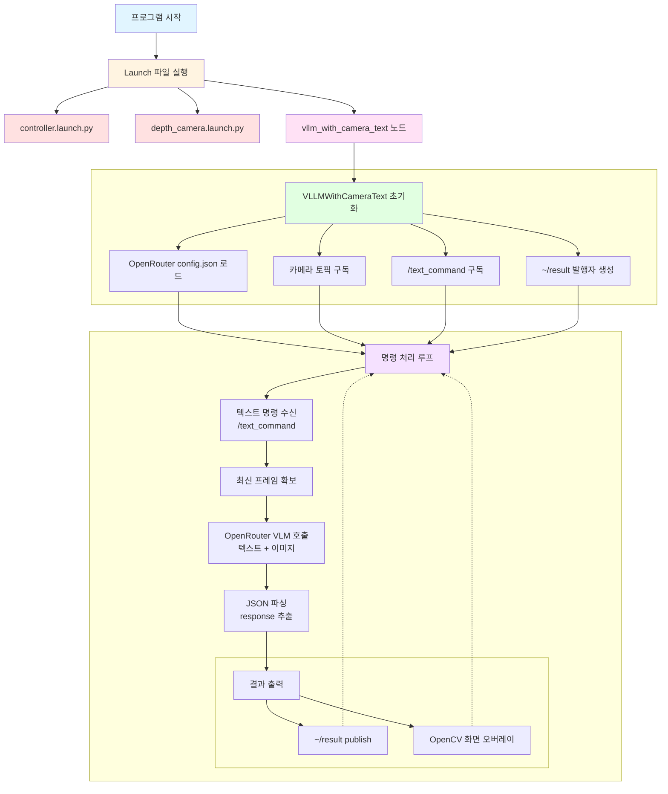
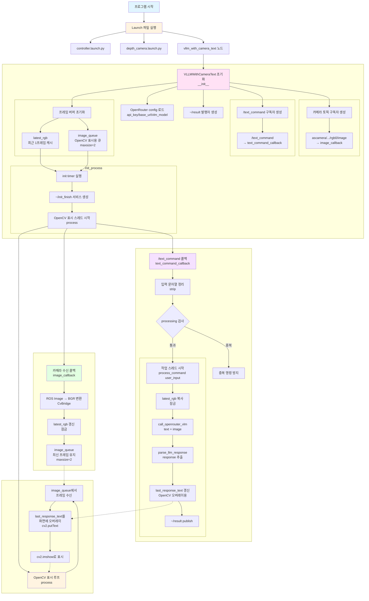
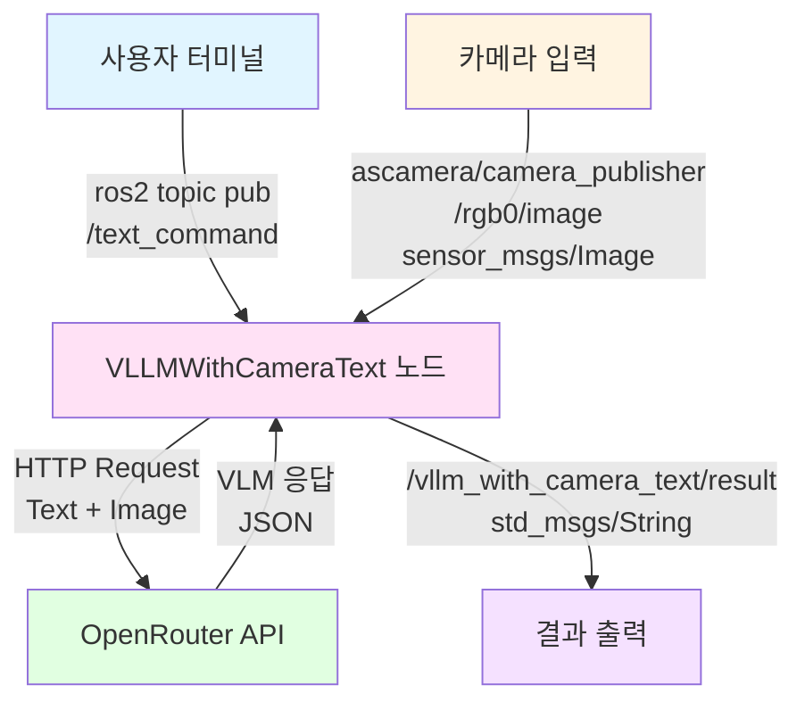

# VLM With Camera

---

## 개요

> OpenRouter API와 ROS2를 활용하여 카메라 이미지 + 자연어 텍스트 명령을 입력으로 받아, 로봇이 현재 상황을 이해하고(무엇이 보이는지/어떤 물체가 있는지 등) 상황 분석 결과를 텍스트로 응답하는 프로젝트입니다.
> 
> 
> 사용자가 “지금 화면에 뭐가 보여?” 또는 “사람이 보여?” 같은 명령을 `/text_command` 토픽으로 보내면, 노드는 최신 카메라 프레임을 함께 VLM(OpenRouter)으로 전달하여 분석 결과를 받아옵니다.
> 

**주요 기능**

- **상황 분석(VLM)**: 카메라 이미지 기반 질의응답 및 장면 설명
- **토픽 기반 입력**: ROS2 `/text_command` 토픽을 통한 텍스트 명령 수신
- **VLM 호출**: OpenRouter API로 텍스트 + 이미지 전달
- **결과 출력**: 분석 결과를 `~/result` 토픽으로 publish + 화면 오버레이 표시
- **응답 검증 로그**: OpenRouter raw 응답/JSON 응답을 로그로 출력(트렁케이션 포함)

## 실습 환경 구성

1. `~/ros2_ws/src/large_models/large_models/openrouter/config.json` 파일을 확인하여 **api_key**, **base_url** 그리고 **vlm_model**이 잘 정의돼 있는지 확인합니다.
2. 먼저 필요한 파일들을 생성하고 코드를 추가합니다.
    
    ```bash
    # VLM 상황 분석 노드
    touch ~/ros2_ws/src/large_models/large_models/vllm_with_camera_text.py
    # Launch 파일
    touch ~/ros2_ws/src/large_models/launch/vllm_with_camera_text.launch.py
    ```

    <details>
    <summary>vllm_with_camera_text.py 코드</summary>
    <div markdown="1">

    ```python
    #!/usr/bin/env python3
    # encoding: utf-8

    import base64
    import json
    import os
    import queue
    import threading
    import time

    import cv2
    import numpy as np
    import rclpy
    import requests
    from cv_bridge import CvBridge
    from rclpy.callback_groups import ReentrantCallbackGroup
    from rclpy.executors import MultiThreadedExecutor
    from rclpy.node import Node
    from sensor_msgs.msg import Image
    from std_msgs.msg import String
    from std_srvs.srv import Empty


    # Load OpenRouter config from source directory
    config_path = '/home/ubuntu/ros2_ws/src/large_models/large_models/openrouter/config.json'
    with open(config_path, 'r') as f:
        openrouter_config = json.load(f)

    OPENROUTER_API_KEY = openrouter_config.get('api_key', '')
    OPENROUTER_BASE_URL = openrouter_config.get('base_url', 'https://openrouter.ai/api/v1')
    OPENROUTER_VLM_MODEL = openrouter_config.get('vlm_model', openrouter_config.get('llm_model', ''))
    GENERATION_CONFIG = openrouter_config.get('generation', {})


    PROMPT = '''
    # Role
    You are a vision assistant for a robot camera.

    # Task
    Given the current camera image and the user's text command, respond concisely.

    # Requirements
    - If the user asks a question about what is visible, describe it.
    - If the user asks to find an object, say whether it is visible.
    - Output JSON only:
    {
    "response": "..."
    }
    '''


    class VLLMWithCameraText(Node):
        def __init__(self, name):
            rclpy.init()
            super().__init__(name)

            self.bridge = CvBridge()
            self.image_queue = queue.Queue(maxsize=2)

            self.latest_frame_lock = threading.Lock()
            self.latest_rgb = None

            self.processing = False
            self.last_response_text = ''

            timer_cb_group = ReentrantCallbackGroup()
            self.callback_group = ReentrantCallbackGroup()

            self.result_pub = self.create_publisher(String, '~/result', 1)

            self.create_subscription(
                Image,
                'ascamera/camera_publisher/rgb0/image',
                self.image_callback,
                1,
            )

            self.create_subscription(
                String,
                '/text_command',
                self.text_command_callback,
                10,
                callback_group=self.callback_group,
            )

            self.timer = self.create_timer(0.0, self.init_process, callback_group=timer_cb_group)

        def _truncate_for_log(self, text, limit=3000):
            if text is None:
                return ''
            text = str(text)
            if len(text) <= limit:
                return text
            return text[:limit] + '...<truncated>'

        def _bgr_to_data_url(self, bgr_image):
            ok, buf = cv2.imencode('.jpg', bgr_image)
            if not ok:
                raise RuntimeError('Failed to encode image')
            b64 = base64.b64encode(buf.tobytes()).decode('utf-8')
            return f'data:image/jpeg;base64,{b64}'

        def init_process(self):
            self.timer.cancel()
            self.create_service(Empty, '~/init_finish', self.get_node_state)

            self.get_logger().info('\033[1;32m%s\033[0m' % '========================================')
            self.get_logger().info('\033[1;32m%s\033[0m' % 'VLLM With Camera (Text Input Mode)')
            self.get_logger().info('\033[1;32m%s\033[0m' % f'Using OpenRouter VLM Model: {OPENROUTER_VLM_MODEL}')
            self.get_logger().info('\033[1;32m%s\033[0m' % '========================================')
            self.get_logger().info('\033[1;33m%s\033[0m' % 'Waiting for commands on /text_command topic...')
            self.get_logger().info('\033[1;33m%s\033[0m' % 'Example: ros2 topic pub -1 /text_command std_msgs/String "data: \'what do you see?\'"')

            threading.Thread(target=self.process, daemon=True).start()

        def get_node_state(self, request, response):
            return response

        def image_callback(self, ros_image):
            try:
                bgr_image = np.array(self.bridge.imgmsg_to_cv2(ros_image, desired_encoding='bgr8'), dtype=np.uint8)

                with self.latest_frame_lock:
                    self.latest_rgb = bgr_image

                if self.image_queue.full():
                    self.image_queue.get()
                self.image_queue.put(bgr_image)
            except Exception as e:
                self.get_logger().error(f'Error converting image: {e}')

        def call_openrouter_vlm(self, user_input, bgr_image):
            if not OPENROUTER_API_KEY:
                raise RuntimeError('OpenRouter api_key is empty. Please set it in config.json')
            if not OPENROUTER_VLM_MODEL:
                raise RuntimeError('OpenRouter vlm_model/llm_model is empty. Please set it in config.json')

            headers = {
                'Authorization': f'Bearer {OPENROUTER_API_KEY}',
                'Content-Type': 'application/json',
            }

            image_url = self._bgr_to_data_url(bgr_image)

            data = {
                'model': OPENROUTER_VLM_MODEL,
                'messages': [
                    {'role': 'system', 'content': PROMPT},
                    {
                        'role': 'user',
                        'content': [
                            {'type': 'text', 'text': user_input},
                            {'type': 'image_url', 'image_url': {'url': image_url}},
                        ],
                    },
                ],
                'temperature': GENERATION_CONFIG.get('temperature', 0.2),
                'top_p': GENERATION_CONFIG.get('top_p', 0.9),
                'max_tokens': GENERATION_CONFIG.get('max_tokens', 512),
            }

            response = requests.post(
                f'{OPENROUTER_BASE_URL}/chat/completions',
                headers=headers,
                json=data,
                timeout=openrouter_config.get('http', {}).get('timeout_sec', 60),
            )

            self.get_logger().info(
                f'OpenRouter HTTP {response.status_code} raw response: {self._truncate_for_log(response.text)}'
            )

            response.raise_for_status()
            result = response.json()
            self.get_logger().info(
                'OpenRouter JSON response: '
                f'{self._truncate_for_log(json.dumps(result, ensure_ascii=False))}'
            )

            return result['choices'][0]['message']['content']

        def parse_llm_response(self, llm_result):
            try:
                start_idx = llm_result.find('{')
                end_idx = llm_result.rfind('}') + 1
                if start_idx != -1 and end_idx > start_idx:
                    json_str = llm_result[start_idx:end_idx]
                    return json.loads(json_str)
            except Exception as e:
                self.get_logger().error(f'JSON parse error: {e}')
            return None

        def text_command_callback(self, msg):
            user_input = msg.data.strip()
            if not user_input:
                return

            self.get_logger().info(f'Received text command: {user_input}')

            if self.processing:
                self.get_logger().warn('Already processing a command, please wait...')
                return

            self.processing = True
            threading.Thread(target=self.process_command, args=(user_input,), daemon=True).start()

        def process_command(self, user_input):
            try:
                with self.latest_frame_lock:
                    bgr = None if self.latest_rgb is None else self.latest_rgb.copy()

                if bgr is None:
                    self.get_logger().warn('No camera image received yet. Please wait...')
                    return

                llm_result = self.call_openrouter_vlm(user_input, bgr)
                if not llm_result:
                    self.get_logger().error('Failed to get response from VLM')
                    return

                self.get_logger().info(f'LLM Response: {llm_result}')

                parsed = self.parse_llm_response(llm_result)
                if parsed and isinstance(parsed, dict):
                    response_text = str(parsed.get('response', '')).strip()
                else:
                    response_text = llm_result

                self.last_response_text = response_text

                out = String()
                out.data = response_text
                self.result_pub.publish(out)

                self.get_logger().info(f'\033[1;32mResponse: {response_text}\033[0m')
            except Exception as e:
                self.get_logger().error(f'process_command failed: {e}')
            finally:
                self.processing = False
                self.get_logger().info('\033[1;33mReady for next command on /text_command\033[0m')

        def process(self):
            cv2.namedWindow('image', cv2.WINDOW_NORMAL)
            cv2.waitKey(10)

            while rclpy.ok():
                image = self.image_queue.get(block=True)
                height, width = image.shape[:2]
                cv2.resizeWindow('image', width, height)

                if self.last_response_text:
                    cv2.putText(
                        image,
                        self.last_response_text[:60],
                        (10, 30),
                        cv2.FONT_HERSHEY_SIMPLEX,
                        0.8,
                        (0, 255, 0),
                        2,
                    )

                cv2.imshow('image', image)
                cv2.waitKey(1)

            cv2.destroyAllWindows()


    def main():
        node = VLLMWithCameraText('vllm_with_camera_text')
        executor = MultiThreadedExecutor()
        executor.add_node(node)
        try:
            executor.spin()
        except KeyboardInterrupt:
            pass
        finally:
            node.destroy_node()


    if __name__ == '__main__':
        main()
    ```

    </div>
    </details>

    <details>
    <summary>vllm_with_camera_text.launch.py 코드</summary>
    <div markdown="1">

    ```Python
    import os
    from ament_index_python.packages import get_package_share_directory

    from launch_ros.actions import Node
    from launch.substitutions import LaunchConfiguration
    from launch import LaunchDescription, LaunchService
    from launch.launch_description_sources import PythonLaunchDescriptionSource
    from launch.actions import IncludeLaunchDescription, DeclareLaunchArgument, OpaqueFunction


    def launch_setup(context):
        mode = LaunchConfiguration('mode', default=1)
        mode_arg = DeclareLaunchArgument('mode', default_value=mode)

        controller_package_path = get_package_share_directory('controller')
        peripherals_package_path = get_package_share_directory('peripherals')

        controller_launch = IncludeLaunchDescription(
            PythonLaunchDescriptionSource(
                os.path.join(controller_package_path, 'launch/controller.launch.py')),
        )

        depth_camera_launch = IncludeLaunchDescription(
            PythonLaunchDescriptionSource(
                os.path.join(peripherals_package_path, 'launch/depth_camera.launch.py')),
        )

        vllm_with_camera_text_node = Node(
            package='large_models',
            executable='vllm_with_camera_text',
            name='vllm_with_camera_text',
            output='screen',
        )

        return [
            mode_arg,
            controller_launch,
            depth_camera_launch,
            vllm_with_camera_text_node,
        ]


    def generate_launch_description():
        return LaunchDescription([
            OpaqueFunction(function=launch_setup)
        ])


    if __name__ == '__main__':
        ld = generate_launch_description()

        ls = LaunchService()
        ls.include_launch_description(ld)
        ls.run()

    ```

    </div>
    </details>

3. `~/ros2_ws/src/large_models/setup.py` 파일을 열고 다음과 같이 수정합니다.
    
    ```python
    entry_points={
        'console_scripts': [
            ...
    
            # 아래 코드 추가
            **'vllm_with_camera_text = large_models.vllm_with_camera_text:main',**
    
            ...
        ],
    },
    ```
    
4. 아래 명령어로 패키지를 빌드합니다.
    
    ```bash
    cd ~/ros2_ws
    colcon build --symlink-install --packages-select large_models
    source install/local_setup.zsh
    ```

## 동작 확인

1. MentorPi를 시작하고 VNC Viewer에 연결합니다.
2. **Terminator**에서 아래 명령어를 입력해 ROS 2관련 자동 실행 서비스를 중지합니다.
    
    ```bash
    ~/.stop_ros.sh
    ```
    
3. VLM 상황 분석 기능을 활성화하기 위해 명령어를 입력합니다.
    
    ```bash
    ros2 launch large_models vllm_with_camera_text.launch.py
    ```
    
4. **새 터미널**을 열고 텍스트 명령을 전송합니다.
    
    ```bash
    # 장면 설명
    ros2 topic pub -1 /text_command std_msgs/String "data: '지금 화면에 뭐가 보이는지 설명해줘'"
    
    # 특정 물체 탐지
    ros2 topic pub -1 /text_command std_msgs/String "data: '사람이 보여?'"
    
    # 안전/장애물 관련 질문
    ros2 topic pub -1 /text_command std_msgs/String "data: '앞에 장애물이 있어?'"
    ```
    
    - 결과를 확인하는 방법
        - `vllm_with_camera_text` 콘솔 로그에 `Response: ...` 출력
        - 토픽으로도 확인 가능
            
            ```bash
            ros2 topic echo /vllm_with_camera_text/result
            ```
            
5. 실습을 종료하려면 launch 터미널에서 `Ctrl+C`를 누릅니다.
6. **LXTerminal**에서 아래 명령어로 로봇 기능들을 다시 활성화하거나, 로봇을 재시작할 수 있습니다.
    
    ```bash
    sudo systemctl restart start_node.service
    ```

## 동작 원리

1. **명령 수신**: ROS2 `/text_command` 토픽을 통해 텍스트 명령 수신
2. **이미지 확보**: 최신 카메라 프레임을 내부에 저장
3. **VLM API 호출**: OpenRouter API에 텍스트 + 이미지(data URL) 전달
4. **응답 파싱**: VLM 응답에서 JSON 형식의 `response` 추출
5. **결과 출력**
    - `~/result` 토픽 발행
    - OpenCV 창에 응답 텍스트 오버레이

## 프로그램 구조



# 코드 분석

---

## 1. Launch 파일 구조

### **launch_setup 함수**

```python
def launch_setup(context):
    controller_package_path = get_package_share_directory('controller')
    peripherals_package_path = get_package_share_directory('peripherals')

    controller_launch = IncludeLaunchDescription(
        PythonLaunchDescriptionSource(
            os.path.join(controller_package_path, 'launch/controller.launch.py')),
    )

    depth_camera_launch = IncludeLaunchDescription(
        PythonLaunchDescriptionSource(
            os.path.join(peripherals_package_path, 'launch/depth_camera.launch.py')),
    )

    vllm_with_camera_text_node = Node(
        package='large_models',
        executable='vllm_with_camera_text',
        name='vllm_with_camera_text',
        output='screen',
    )

    return [
        controller_launch,
        depth_camera_launch,
        vllm_with_camera_text_node,
    ]
```

- **depth_camera_launch**: 카메라 노드 실행
- **controller_launch**: 로봇 컨트롤러 노드 실행
- **vllm_with_camera_text_node**: VLM 작업 수행 노드 실행

## 2. VLLMWithCameraText 클래스

### **노드 초기화**

```python
class VLLMWithCameraText(Node):
    def __init__(self, name):
		    ...
				self.processing = False
				self.last_response_text = ''
				
				self.result_pub = self.create_publisher(String, '~/result', 1)
				
				self.create_subscription(
				    Image,
				    'ascamera/camera_publisher/rgb0/image',
				    self.image_callback,
				    1,
				)
				
				self.create_subscription(
				    String,
				    '/text_command',
				    self.text_command_callback,
				    10,
				    callback_group=self.callback_group,
				)
```

- **processing**: 동시에 여러 명령이 들어올 때 중복 처리 방지
- **~/result**: 분석 결과를 다른 노드/터미널에서 확인 가능하도록 publish
- **카메라 구독**: 최신 프레임을 저장하고 화면 출력에도 사용

## 3. 프롬프트 설계

### **PROMPT**

```python
PROMPT = '''
# Role
You are a vision assistant for a robot camera.

# Task
Given the current camera image and the user's text command, respond concisely.

# Requirements
- If the user asks a question about what is visible, describe it.
- If the user asks to find an object, say whether it is visible.
- Output JSON only:
{
  "response": "..."
}
'''
```

## 4. OpenRouter API 호출 (텍스트 + 이미지)

### **call_openrouter_vlm 함수의 핵심 구조**

```python
def call_openrouter_vlm(self, user_input, bgr_image):
		...

		headers = {
		    'Authorization': f'Bearer {OPENROUTER_API_KEY}',
		    'Content-Type': 'application/json',
		}
		
		data = {
		    'model': OPENROUTER_VLM_MODEL,
		    'messages': [
		        {'role': 'system', 'content': PROMPT},
		        {
		            'role': 'user',
		            'content': [
		                {'type': 'text', 'text': user_input},
		                {'type': 'image_url', 'image_url': {'url': image_url}},
		            ],
		        },
		    ],
		    'temperature': GENERATION_CONFIG.get('temperature', 0.2),
		    'top_p': GENERATION_CONFIG.get('top_p', 0.9),
		    'max_tokens': GENERATION_CONFIG.get('max_tokens', 512),
		}
		
		response = requests.post(
		    f'{OPENROUTER_BASE_URL}/chat/completions',
		    headers=headers,
		    json=data,
		)
```

- `image_url`은 data URL(`data:image/jpeg;base64,...`) 형식으로 전달
- HTTP raw 응답과 JSON 응답을 로그로 출력하여, 모델이 실제로 어떤 값을 반환했는지 확인할 수 있음

## 5. 응답 파싱

### **parse_llm_response 함수**

> 모델이 JSON 외의 텍스트를 앞뒤로 섞어 보내는 경우가 있어, `{ ... }` 범위만 잘라 파싱
> 

```python
def parse_llm_response(self, llm_result):
    start_idx = llm_result.find('{')
    end_idx = llm_result.rfind('}') + 1
    if start_idx != -1 and end_idx > start_idx:
        json_str = llm_result[start_idx:end_idx]
        return json.loads(json_str)
    return None
```

## 6. 토픽 콜백 처리

### **text_command_callback 함수**

> OpenRouter API 호출은 네트워크 지연이 있을 수 있으므로, 콜백에서 바로 blocking하지 않고 **별도 스레드**로 실행
> 

```python
def text_command_callback(self, msg):
    user_input = msg.data.strip()
    if not user_input:
        return

    if self.processing:
        self.get_logger().warn('Already processing a command, please wait...')
        return

    self.processing = True
    threading.Thread(target=self.process_command, args=(user_input,), daemon=True).start()
```

## 코드 흐름도



## 노드 간 통신 구조

