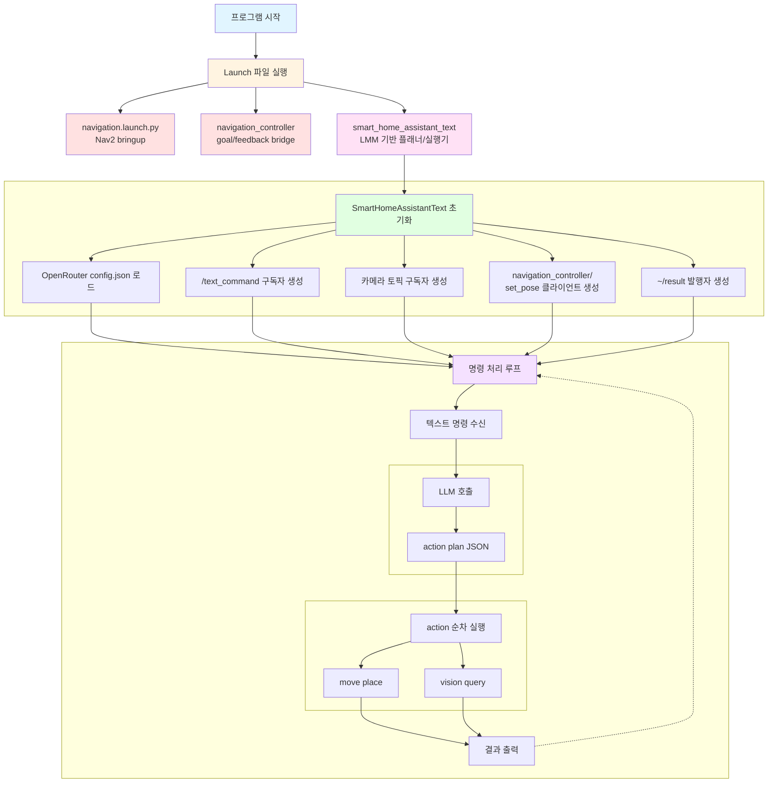
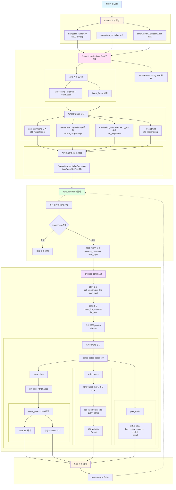
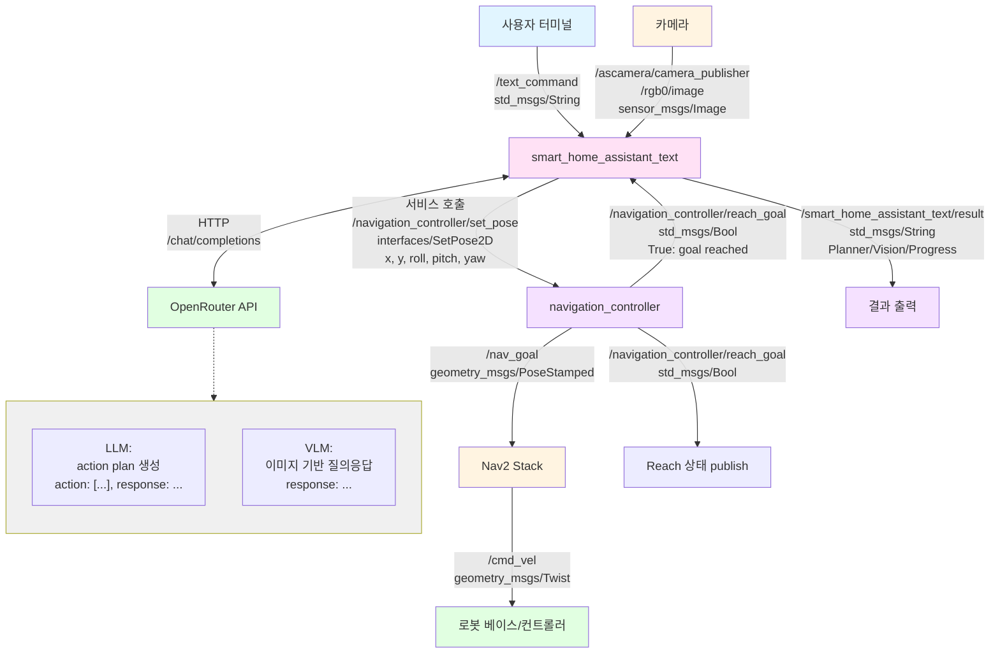

# Smart Home Assistant Robot (Nav2 + LMM)

---

## 개요

> 이번 Final Project에서는 Nav2 기반 자율주행과 LMM(LLM/VLM) 기반 상황 이해를 결합하여, 집 안을 이동하며 사용자의 요청을 수행하는 스마트 홈 어시스턴트 로봇을 구현합니다.
> 
> 
> 사용자는 자연어로 “현관으로 가서 문이 닫혀있는지 확인해줘”, “주방으로 가서 뭐가 있는지 설명해줘” 같은 명령을 내릴 수 있고, 로봇은 이를 **행동 계획(action plan)** 으로 바꾼 뒤 순차 실행합니다.
> 

**주요 기능**

- **자연어 이해(LLM)**: 사용자의 텍스트 명령을 계획(JSON)으로 변환
- **자율주행(Nav2)**: 목표 지점으로 이동 (navigation_controller + Nav2)
- **상황 분석(VLM/LMM)**: 카메라 기반 질의응답(문 닫힘 여부, 물체 존재 여부 등)
- **토픽 기반 입력**: ROS2 `/text_command`로 명령 전달
- **결과 피드백**: `~/result` 토픽 출력(필요 시 UI/로그 표시)

## 실습 환경 구성

1. `~/ros2_ws/src/large_models/large_models/openrouter/config.json` 파일을 확인하여 **api_key**, **llm_model**, **vlm_model**이 잘 정의돼 있는지 확인합니다.
2. Nav2/Navigation 관련 패키지와 Launch가 동작하는지 확인합니다.
    - 이전 실습의 `navigation.launch.py`가 정상 구동 필요
3. 먼저 필요한 파일들을 생성하고 코드를 추가합니다.
    
    ```bash
    # Final Project 노드
    touch ~/ros2_ws/src/large_models/large_models/smart_home_assistant_text.py
    
    # Final Project Launch 파일
    touch ~/ros2_ws/src/large_models/launch/smart_home_assistant_text.launch.py
    ```
    <details>
    <summary>smart_home_assistant_text.py 코드</summary>
    <div markdown="1">

    ```python
    #!/usr/bin/env python3
    # encoding: utf-8

    import base64
    import json
    import os
    import re
    import threading
    import time

    import cv2
    import numpy as np
    import rclpy
    import requests
    from cv_bridge import CvBridge
    from rclpy.callback_groups import ReentrantCallbackGroup
    from rclpy.executors import MultiThreadedExecutor
    from rclpy.node import Node
    from sensor_msgs.msg import Image
    from std_msgs.msg import String, Bool

    from interfaces.srv import SetPose2D


    # -----------------------------
    # OpenRouter configuration
    # -----------------------------
    config_path = '/home/ubuntu/ros2_ws/src/large_models/large_models/openrouter/config.json'
    with open(config_path, 'r') as f:
        openrouter_config = json.load(f)

    OPENROUTER_API_KEY = openrouter_config.get('api_key', '')
    OPENROUTER_BASE_URL = openrouter_config.get('base_url', 'https://openrouter.ai/api/v1')
    OPENROUTER_LLM_MODEL = openrouter_config.get('llm_model', '')
    OPENROUTER_VLM_MODEL = openrouter_config.get('vlm_model', '')
    GENERATION_CONFIG = openrouter_config.get('generation', {})


    # -----------------------------
    # Navigation targets
    # -----------------------------
    position_dict = { # x, y, z, r, p, y
        'kitchen': [3.56647, -2.01839, 0.0, -0.190172, 0.981751],
        'front desk': [1.93939, 1.06236, 0.0, 0.0, 0.399843],
        'bedroom': [3.14153, -0.321892, 0.0, 0.0, 0.0733996],
        'zoo': [1.13, 0.0179, 0.0, 0.0, 0.9790],
        'space base': [1.58, -0.74, 0.0, 0.0, -48.0],
        'football field': [0.32, -0.65, 0.0, 0.0, -90.0],
        'origin': [0.0, 0.0, 0.0, 0.0, 0.0],
        'home': [1.0, 0.0, 0.0, 0.0, 0.0],
    }


    # -----------------------------
    # Prompts
    # -----------------------------
    LLM_PROMPT = f'''
    ## Role
    You are a robot navigation planner.

    ## Task
    Convert the user's instruction into a JSON plan using the action function library.

    ## Requirements
    1. Output JSON only.
    2. Output format:
    {{
    "action": ["...", "..."],
    "response": "..."
    }}
    3. "response" must be Korean.
    4. If you cannot map the instruction to actions, return "action": [] and explain in "response".

    ## Action Function Library
    - Move to a named place: move('<place>')
    - Analyze current camera view with a query: vision('<question>')
    - Speak/announce the result: play_audio()

    ## Available places
    {', '.join(sorted(position_dict.keys()))}

    ## Examples
    Input: Go to the front desk and check if the door is closed
    Output: {{"action": ["move('front desk')", "vision('Is the door closed?')", "play_audio()"], "response": "On it."}}
    '''

    VLM_PROMPT = '''
    # Role
    You are a helpful robot butler.

    # Task
    Given an image and a user query, answer directly.

    # Requirements
    - Do not ask questions back.
    - 20 to 40 Korean words.
    - Output JSON only:
    {
    "response": "..."
    }
    '''


    class VLLMNavigationText(Node):
        def __init__(self, name):
            rclpy.init()
            super().__init__(name)

            # -----------------------------
            # Runtime state
            # -----------------------------
            self.processing = False
            self.interrupt = False
            self.reach_goal = False

            self.latest_frame_lock = threading.Lock()
            self.latest_bgr = None
            self.last_vision_response = ''

            # -----------------------------
            # ROS interfaces
            # -----------------------------
            self.bridge = CvBridge()
            self.callback_group = ReentrantCallbackGroup()
            timer_cb_group = ReentrantCallbackGroup()

            # Publish the final response for users/other nodes
            self.result_pub = self.create_publisher(String, '~/result', 1)

            # Camera input for vision() action
            self.create_subscription(
                Image,
                'ascamera/camera_publisher/rgb0/image',
                self.image_callback,
                1,
            )

            # Text command input
            self.create_subscription(
                String,
                '/text_command',
                self.text_command_callback,
                10,
                callback_group=self.callback_group,
            )

            # Navigation feedback
            self.create_subscription(
                Bool,
                'navigation_controller/reach_goal',
                self.reach_goal_callback,
                1,
            )

            # Navigation goal service
            self.set_pose_client = self.create_client(SetPose2D, 'navigation_controller/set_pose')
            self.set_pose_client.wait_for_service()

            # Print status once the node is ready
            self.timer = self.create_timer(0.0, self.init_process, callback_group=timer_cb_group)

        # -----------------------------
        # Utility helpers
        # -----------------------------
        def _truncate_for_log(self, text, limit=3000):
            if text is None:
                return ''
            text = str(text)
            if len(text) <= limit:
                return text
            return text[:limit] + '...<truncated>'

        def _bgr_to_data_url(self, bgr_image):
            ok, buf = cv2.imencode('.jpg', bgr_image)
            if not ok:
                raise RuntimeError('Failed to encode image')
            b64 = base64.b64encode(buf.tobytes()).decode('utf-8')
            return f'data:image/jpeg;base64,{b64}'

        def _publish_result(self, text):
            msg = String()
            msg.data = text
            self.result_pub.publish(msg)

        # -----------------------------
        # Node lifecycle
        # -----------------------------
        def init_process(self):
            self.timer.cancel()

            self.get_logger().info('\033[1;32m%s\033[0m' % '========================================')
            self.get_logger().info('\033[1;32m%s\033[0m' % 'VLLM Navigation (Text Input Mode)')
            self.get_logger().info('\033[1;32m%s\033[0m' % f'LLM Model: {OPENROUTER_LLM_MODEL}')
            self.get_logger().info('\033[1;32m%s\033[0m' % f'VLM Model: {OPENROUTER_VLM_MODEL}')
            self.get_logger().info('\033[1;32m%s\033[0m' % '========================================')
            self.get_logger().info('\033[1;33m%s\033[0m' % 'Waiting for commands on /text_command ...')

        # -----------------------------
        # ROS callbacks
        # -----------------------------
        def image_callback(self, ros_image):
            # Keep the latest frame for vision queries
            try:
                bgr = np.array(self.bridge.imgmsg_to_cv2(ros_image, desired_encoding='bgr8'), dtype=np.uint8)
                with self.latest_frame_lock:
                    self.latest_bgr = bgr
            except Exception as e:
                self.get_logger().error(f'Error converting image: {e}')

        def reach_goal_callback(self, msg):
            # Navigation controller notifies when the robot reaches the goal
            self.reach_goal = msg.data

        def text_command_callback(self, msg):
            # Main entry point: user sends a natural language command
            user_input = msg.data.strip()
            if not user_input:
                return

            # Allow an emergency cancel
            if user_input.lower() in ('stop', 'cancel', 'abort'):
                self.interrupt = True
                self.get_logger().warn('Interrupt requested by user')
                return

            self.get_logger().info(f'Received text command: {user_input}')

            if self.processing:
                self.get_logger().warn('Already processing a command, please wait...')
                return

            self.processing = True
            self.interrupt = False
            threading.Thread(target=self.process_command, args=(user_input,), daemon=True).start()

        # -----------------------------
        # OpenRouter API calls
        # -----------------------------
        def call_openrouter_llm(self, user_input):
            # Call LLM to get a structured action plan
            if not OPENROUTER_API_KEY:
                raise RuntimeError('OpenRouter api_key is empty. Please set it in config.json')
            if not OPENROUTER_LLM_MODEL:
                raise RuntimeError('OpenRouter llm_model is empty. Please set it in config.json')

            headers = {
                'Authorization': f'Bearer {OPENROUTER_API_KEY}',
                'Content-Type': 'application/json',
            }

            data = {
                'model': OPENROUTER_LLM_MODEL,
                'messages': [
                    {'role': 'system', 'content': LLM_PROMPT},
                    {'role': 'user', 'content': user_input},
                ],
                'temperature': GENERATION_CONFIG.get('temperature', 0.2),
                'top_p': GENERATION_CONFIG.get('top_p', 0.9),
                'max_tokens': GENERATION_CONFIG.get('max_tokens', 512),
            }

            response = requests.post(
                f'{OPENROUTER_BASE_URL}/chat/completions',
                headers=headers,
                json=data,
                timeout=openrouter_config.get('http', {}).get('timeout_sec', 60),
            )

            # self.get_logger().info(
            #     f'OpenRouter LLM HTTP {response.status_code} raw response: {self._truncate_for_log(response.text)}'
            # )

            response.raise_for_status()
            result = response.json()
            # self.get_logger().info(
            #     'OpenRouter LLM JSON response: '
            #     f'{self._truncate_for_log(json.dumps(result, ensure_ascii=False))}'
            # )

            return result['choices'][0]['message']['content']

        def call_openrouter_vlm(self, query, bgr_image):
            # Call VLM with the latest camera frame
            if not OPENROUTER_API_KEY:
                raise RuntimeError('OpenRouter api_key is empty. Please set it in config.json')
            if not OPENROUTER_VLM_MODEL:
                raise RuntimeError('OpenRouter vlm_model/llm_model is empty. Please set it in config.json')

            headers = {
                'Authorization': f'Bearer {OPENROUTER_API_KEY}',
                'Content-Type': 'application/json',
            }

            image_url = self._bgr_to_data_url(bgr_image)

            data = {
                'model': OPENROUTER_VLM_MODEL,
                'messages': [
                    {'role': 'system', 'content': VLM_PROMPT},
                    {
                        'role': 'user',
                        'content': [
                            {'type': 'text', 'text': query},
                            {'type': 'image_url', 'image_url': {'url': image_url}},
                        ],
                    },
                ],
                'temperature': GENERATION_CONFIG.get('temperature', 0.2),
                'top_p': GENERATION_CONFIG.get('top_p', 0.9),
                'max_tokens': GENERATION_CONFIG.get('max_tokens', 512),
            }

            response = requests.post(
                f'{OPENROUTER_BASE_URL}/chat/completions',
                headers=headers,
                json=data,
                timeout=openrouter_config.get('http', {}).get('timeout_sec', 60),
            )

            # self.get_logger().info(
            #     f'OpenRouter VLM HTTP {response.status_code} raw response: {self._truncate_for_log(response.text)}'
            # )

            response.raise_for_status()
            result = response.json()
            # self.get_logger().info(
            #     'OpenRouter VLM JSON response: '
            #     f'{self._truncate_for_log(json.dumps(result, ensure_ascii=False))}'
            # )

            return result['choices'][0]['message']['content']

        # -----------------------------
        # Parsing and execution
        # -----------------------------
        def parse_json(self, llm_result):
            # Extract JSON even if the model adds extra text
            try:
                start_idx = llm_result.find('{')
                end_idx = llm_result.rfind('}') + 1
                if start_idx != -1 and end_idx > start_idx:
                    return json.loads(llm_result[start_idx:end_idx])
            except Exception as e:
                self.get_logger().error(f'JSON parse error: {e}')
            return None

        def parse_action(self, action_str):
            # Parse supported actions without eval()
            m = re.fullmatch(r"move\('([^']+)'\)", action_str)
            if m:
                return ('move', m.group(1))

            m = re.fullmatch(r"vision\('(.+)'\)", action_str)
            if m:
                return ('vision', m.group(1))

            if re.fullmatch(r'play_audio\(\)', action_str):
                return ('play_audio', None)

            return (None, None)

        def move(self, place):
            # Send navigation goal to navigation_controller
            if place not in position_dict:
                raise ValueError(f'Unknown place: {place}')

            p = position_dict[place]
            msg = SetPose2D.Request()
            msg.data.x = float(p[0])
            msg.data.y = float(p[1])
            msg.data.roll = float(p[2])
            msg.data.pitch = float(p[3])
            msg.data.yaw = float(p[4])

            self.set_pose_client.call_async(msg)
            self.get_logger().info(f"Sent goal: {place} -> x={p[0]:.3f}, y={p[1]:.3f}, yaw={p[4]:.3f}")

        def vision(self, query):
            # Query the camera image using VLM
            with self.latest_frame_lock:
                bgr = None if self.latest_bgr is None else self.latest_bgr.copy()

            if bgr is None:
                raise RuntimeError('No camera image received yet. Please wait...')

            raw = self.call_openrouter_vlm(query, bgr)
            parsed = self.parse_json(raw)
            if parsed and isinstance(parsed, dict) and 'response' in parsed:
                return str(parsed['response']).strip()
            return raw

        def play_audio(self):
            # In text mode, "play_audio" means publishing the latest vision/summary to a topic
            to_say = self.last_vision_response
            if not to_say:
                to_say = 'No vision result available.'
            self._publish_result(to_say)
            self.get_logger().info(f'Published: {to_say}')

        def process_command(self, user_input):
            try:
                # Ask LLM to generate an action plan
                llm_raw = self.call_openrouter_llm(user_input)
                self.get_logger().info(f'LLM Response: {llm_raw}')

                parsed = self.parse_json(llm_raw)
                if not parsed or not isinstance(parsed, dict):
                    self._publish_result('Failed to parse LLM response.')
                    return

                # Publish the short response first
                response_text = str(parsed.get('response', '')).strip()
                if response_text:
                    self._publish_result(response_text)
                    self.get_logger().info(f'Response: {response_text}')

                # Execute the action list sequentially
                actions = parsed.get('action', [])
                if not isinstance(actions, list):
                    actions = []

                for action_str in actions:
                    if self.interrupt:
                        self.get_logger().warn('Interrupted')
                        break

                    if not isinstance(action_str, str):
                        continue

                    kind, arg = self.parse_action(action_str)
                    if kind is None:
                        self.get_logger().warn(f'Unsupported action: {action_str}')
                        continue

                    # move('place')
                    if kind == 'move':
                        self.reach_goal = False
                        self.move(arg)

                        # Wait until the navigation controller reports goal reached
                        while rclpy.ok() and not self.reach_goal:
                            if self.interrupt:
                                self.get_logger().warn('Interrupted while moving')
                                break
                            time.sleep(0.05)

                    # vision('query')
                    elif kind == 'vision':
                        res = self.vision(arg)
                        self.last_vision_response = res
                        self._publish_result(res)
                        self.get_logger().info(f'Vision result: {res}')

                    # play_audio()
                    elif kind == 'play_audio':
                        self.play_audio()

            except Exception as e:
                self.get_logger().error(f'process_command failed: {e}')
            finally:
                self.processing = False
                self.get_logger().info('\033[1;33mReady for next command on /text_command\033[0m')


    def main():
        node = VLLMNavigationText('vllm_navigation_text')
        executor = MultiThreadedExecutor()
        executor.add_node(node)
        try:
            executor.spin()
        except KeyboardInterrupt:
            pass
        finally:
            node.destroy_node()


    if __name__ == '__main__':
        main()


    ```

    </div>
    </details>

    <details>
    <summary>smart_home_assistant_text.launch.py 코드</summary>
    <div markdown="1">

    ```python
    import os
    from ament_index_python.packages import get_package_share_directory

    from launch_ros.actions import Node
    from launch import LaunchDescription, LaunchService
    from launch.substitutions import LaunchConfiguration
    from launch.launch_description_sources import PythonLaunchDescriptionSource
    from launch.actions import DeclareLaunchArgument, IncludeLaunchDescription, OpaqueFunction, ExecuteProcess


    def launch_setup(context):
        navigation_package_path = get_package_share_directory('navigation')

        map_name = LaunchConfiguration('map', default='my_map').perform(context)
        robot_name = LaunchConfiguration('robot_name', default=os.environ['HOST'])
        master_name = LaunchConfiguration('master_name', default=os.environ['MASTER'])

        map_name_arg = DeclareLaunchArgument('map', default_value=map_name)
        master_name_arg = DeclareLaunchArgument('master_name', default_value=master_name)
        robot_name_arg = DeclareLaunchArgument('robot_name', default_value=robot_name)

        navigation_launch = IncludeLaunchDescription(
            PythonLaunchDescriptionSource(os.path.join(navigation_package_path, 'launch/navigation.launch.py')),
            launch_arguments={
                'sim': 'false',
                'map': map_name,
                'robot_name': robot_name,
                'master_name': master_name,
                'use_teb': 'true',
            }.items(),
        )

        navigation_controller_node = Node(
            package='large_models',
            executable='navigation_controller',
            output='screen',
            parameters=[{'map_frame': 'map', 'nav_goal': '/nav_goal'}],
        )

        # rviz_node = ExecuteProcess(
        #     cmd=['rviz2', 'rviz2', '-d', os.path.join(navigation_package_path, 'rviz/navigation_controller.rviz')],
        #     output='screen',
        # )

        smart_home_assistant_text_node = Node(
            package='large_models',
            executable='smart_home_assistant_text',
            name='smart_home_assistant_text',
            output='screen',
        )

        return [
            map_name_arg,
            master_name_arg,
            robot_name_arg,
            navigation_launch,
            navigation_controller_node,
            # rviz_node,
            smart_home_assistant_text_node,
        ]


    def generate_launch_description():
        return LaunchDescription([
            OpaqueFunction(function=launch_setup)
        ])


    if __name__ == '__main__':
        ld = generate_launch_description()

        ls = LaunchService()
        ls.include_launch_description(ld)
        ls.run()

    ```

    </div>
    </details>

4. `~/ros2_ws/src/large_models/setup.py` 파일을 열고 다음과 같이 수정합니다.
    
    ```python
    entry_points={
        'console_scripts': [
              ...
              
              # 아래 코드 추가
              'smart_home_assistant_text = large_models.smart_home_assistant_text:main',
            ...
        ],
    },
    ```
    
5. 아래 명령어로 패키지를 빌드합니다.
    
    ```bash
    cd ~/ros2_ws
    colcon build --symlink-install --packages-select large_models
    source install/local_setup.zsh
    ```

## 동작 확인

1. MentorPi를 시작하고 VNC Viewer에 연결합니다.
2. **Terminator**에서 아래 명령어를 입력해 ROS 2관련 자동 실행 서비스를 중지합니다.
    
    ```bash
    ~/.stop_ros.sh
    ```
    
3. 아래 명령어로 런치 파일을 실행합니다.
    
    ```bash
    ros2 launch large_models smart_home_assistant_text.launch.py
    ```
    
    - Remote Ubuntu PC에서 아래 명령어로 RViz2를 실행시켜줍니다.
        
        ```bash
        ros2 launch navigation rviz_navigation.launch.py
        ```
4. **새 터미널**을 열고 텍스트 명령을 전송합니다.
    
    ```bash
    # 1) 현관(Front desk)으로 이동 후 문 상태 확인
    ros2 topic pub -1 /text_command std_msgs/String "data: 'Go to the front desk and check if the door is closed'"
    
    # 2) 주방으로 이동 후 상황 요약
    ros2 topic pub -1 /text_command std_msgs/String "data: 'Go to the kitchen and tell me what you see'"
    
    # 3) 집(home)으로 복귀
    ros2 topic pub -1 /text_command std_msgs/String "data: 'Go back home'"
    ```
5. 런치파일을 실행했던 터미널에서 결과를 확인합니다.
6. 실습을 종료하려면 launch 터미널에서 `Ctrl+C`를 누릅니다.
7. **LXTerminal**에서 아래 명령어로 로봇 기능들을 다시 활성화하거나, 로봇을 재시작할 수 있습니다.
    
    ```bash
    sudo systemctl restart start_node.service
    ```

## 동작 원리

1. **명령 수신**: ROS2 `/text_command` 토픽을 통해 텍스트 명령 수신
2. **계획 생성(LLM)**: OpenRouter LLM이 사용자의 문장을 해석하여 `action` 리스트를 생성
3. **이동(Nav2)**: `move('<place>')` 실행 시 `navigation_controller/set_pose`로 목표를 전달
4. **상황 분석(VLM/LMM)**: `vision('<query>')` 실행 시 최신 카메라 프레임과 질의를 VLM으로 전달
5. **피드백 출력**: 각 단계 결과를 `~/result` 토픽 및 로그로 출력


## 프로그램 구조




# 코드 분석

---

## 1. Launch 파일 구조

### **launch_setup 함수**

```python
def launch_setup(context):
    navigation_package_path = get_package_share_directory('navigation')
    navigation_launch = IncludeLaunchDescription(
        PythonLaunchDescriptionSource(
            os.path.join(navigation_package_path, 'launch/navigation.launch.py')
        ),
        launch_arguments={
            'sim': 'false',
            'map': 'my_map',
            'use_teb': 'true',
            ...
        }.items(),
    )
    navigation_controller_node = Node(
        package='large_models',
        executable='navigation_controller',
        output='screen',
        parameters=[{'map_frame': 'map', 'nav_goal': '/nav_goal'}],
    )
    smart_home_assistant_node = Node(
        package='large_models',
        executable='smart_home_assistant_text',
        name='smart_home_assistant_text',
        output='screen',
    )
    return [
        navigation_launch,
        navigation_controller_node,
        smart_home_assistant_node,
    ]
```

- **Nav2 bringup 실행**: `navigation.launch.py`
- **goal 전달/도착 상태 제공**: `navigation_controller`
- **LMM 기반 플래너/실행기**: `smart_home_assistant_text`


## 2. SmartHomeAssistantText 클래스

### **노드 초기화**

```python
import threading
 
 import rclpy
 from rclpy.node import Node
 from rclpy.callback_groups import ReentrantCallbackGroup
 from std_msgs.msg import String, Bool
 from sensor_msgs.msg import Image
 from interfaces.srv import SetPose2D
 
 
 class SmartHomeAssistantText(Node):
     def __init__(self, name):
         rclpy.init()
         super().__init__(name)
 
         # State flags for concurrency control
         self.processing = False
         self.interrupt = False
         self.reach_goal = False
 
         # Latest camera frame for vision queries
         self.latest_frame_lock = threading.Lock()
         self.latest_bgr = None
 
         # Callback groups (avoid blocking the executor)
         self.callback_group = ReentrantCallbackGroup()
 
         # Publish text feedback to the user
         self.result_pub = self.create_publisher(String, '~/result', 1)
 
         # Receive user commands
         self.create_subscription(
             String,
             '/text_command',
             self.text_command_callback,
             10,
             callback_group=self.callback_group,
         )
 
         # Receive camera frames
         self.create_subscription(
             Image,
             'ascamera/camera_publisher/rgb0/image',
             self.image_callback,
             1,
         )
 
         # Navigation feedback
         self.create_subscription(
             Bool,
             'navigation_controller/reach_goal',
             self.reach_goal_callback,
             1,
         )
 
         # Navigation goal service
         self.set_pose_client = self.create_client(SetPose2D, 'navigation_controller/set_pose')
         self.set_pose_client.wait_for_service()
 
         ...
```

- **입력**: `/text_command` 구독
- **비전 입력**: 카메라 토픽 구독(vision action에서 사용)
- **이동 출력**: `navigation_controller/set_pose` 서비스 클라이언트
- **상태 피드백**: `navigation_controller/reach_goal` 구독
- 추가로 `processing` 플래그를 두는 이유
    - LLM/VLM 호출이 네트워크 지연을 포함하므로 **동시에 여러 명령이 들어올 때 액션이 섞이는 문제**를 방지하기 위함

## 3. 프롬프트 설계

### **LLM Prompt (Planner)**

> LLM은 사용자의 자연어를 **실행 가능한 action 시퀀스**로 바꿈
> 

```python
LLM_PROMPT = f'''
		## Role
		You are a robot navigation planner.
		
		## Task
		Convert the user's instruction into a JSON plan using the action function library.
		
		## Requirements
		1. Output JSON only.
		2. Output format:
		{{
		  "action": ["...", "..."],
		  "response": "..."
		}}
		3. "response" must be Korean.
		4. If you cannot map the instruction to actions, return "action": [] and explain in "response".
		
		## Action Function Library
		- Move to a named place: move('<place>')
		- Analyze current camera view with a query: vision('<question>')
		- Speak/announce the result: play_audio()
		
		## Available places
		{', '.join(sorted(position_dict.keys()))}
		
		## Examples
		Input: Go to the front desk and check if the door is closed
		Output: {{"action": ["move('front desk')", "vision('Is the door closed?')", "play_audio()"], "response": "On it."}}
'''
```

- 여기서의 action은 “로봇이 해야 할 일의 순서”이며, 실제 실행은 ROS2 노드가 담당
- 목표: 사용자의 자연어를 아래 형식의 JSON 계획으로 변환


### **VLM/LMM Prompt (Vision)**

> Vision 프롬프트는 **“문 닫힘 여부 확인”**, **“지금 뭐가 보이는지 설명”** 같은 요청을 처리할 때 사용
> 

```python
VLM_PROMPT = '''
		# Role
		You are a helpful robot butler.
		
		# Task
		Given an image and a user query, answer directly.
		
		# Requirements
		- Do not ask questions back.
		- 20 to 40 Korean words.
		- Output JSON only:
		{
		  "response": "..."
		}
'''
```

- 입력: `query + latest camera frame`
- 출력: `{ "response": "..." }`
- 목표: 이미지 + 질문에 대해 **추가 질문 없이** 요약 응답


## 4. OpenRouter API 호출

### **LLM 호출 (계획 생성)**

> 자연어 → 실행 계획(JSON) 변환을 담당
> 

```python
import requests
 
 
 def call_openrouter_llm(self, user_input: str) -> str:
     headers = {
         'Authorization': f'Bearer {OPENROUTER_API_KEY}',
         'Content-Type': 'application/json',
     }
 
     data = {
         'model': OPENROUTER_LLM_MODEL,
         'messages': [
             {'role': 'system', 'content': LLM_PROMPT},
             {'role': 'user', 'content': user_input},
         ],
         'temperature': GENERATION_CONFIG.get('temperature', 0.2),
         'top_p': GENERATION_CONFIG.get('top_p', 0.9),
         'max_tokens': GENERATION_CONFIG.get('max_tokens', 512),
     }
 
     resp = requests.post(
         f'{OPENROUTER_BASE_URL}/chat/completions',
         headers=headers,
         json=data,
         timeout=openrouter_config.get('http', {}).get('timeout_sec', 60),
     )
 
     resp.raise_for_status()
     result = resp.json()
     return result['choices'][0]['message']['content']
```

- 네트워크 호출이므로 콜백 내부에서 직접 실행하면 executor가 막힐 수 있음
    - 따라서 `process_command()` 스레드에서 호출하도록 구성


### **VLM 호출 (상황 분석)**

> `latest frame` 1장만 사용하고, 이미지는 JPG로 인코딩 후 data URL로 전달
> 

```python
 def call_openrouter_vlm(self, query: str, bgr_image) -> str:
     headers = {
         'Authorization': f'Bearer {OPENROUTER_API_KEY}',
         'Content-Type': 'application/json',
     }
 
     image_url = self._bgr_to_data_url(bgr_image)
 
     data = {
         'model': OPENROUTER_VLM_MODEL,
         'messages': [
             {'role': 'system', 'content': VLM_PROMPT},
             {
                 'role': 'user',
                 'content': [
                     {'type': 'text', 'text': query},
                     {'type': 'image_url', 'image_url': {'url': image_url}},
                 ],
             },
         ],
         'temperature': GENERATION_CONFIG.get('temperature', 0.2),
         'top_p': GENERATION_CONFIG.get('top_p', 0.9),
         'max_tokens': GENERATION_CONFIG.get('max_tokens', 512),
     }
 
     resp = requests.post(
         f'{OPENROUTER_BASE_URL}/chat/completions',
         headers=headers,
         json=data,
         timeout=openrouter_config.get('http', {}).get('timeout_sec', 60),
     )
 
     resp.raise_for_status()
     result = resp.json()
     return result['choices'][0]['message']['content']
```


## 5. 응답 파싱 및 실행

### **parse_llm_response / parse_action**

```python
 import json
 
 
 def parse_llm_response(self, llm_result: str):
     ...
 
     return json.loads(json_str)

 def parse_action(self, action_str: str):
    ...

    if re.fullmatch(r"play_audio\(\)", action_str):
        return ('play_audio', None)

    return (None, None)
```


## 6. 토픽 콜백 처리

### **text_command_callback**

> 사용자 명령에 대한 토픽을 받아서 callback 처리
> 

```python
 def text_command_callback(self, msg):
     user_input = msg.data.strip()
     if not user_input:
         return
 
     if self.processing:
         self.get_logger().warn('Already processing a command, please wait...')
         return
 
     self.processing = True
     self.interrupt = False
 
     # Run heavy logic in a worker thread (network calls)
     threading.Thread(target=self.process_command, args=(user_input,), daemon=True).start()
```

### **process_command**

> action 종류에 따라 처리하는 부분
> 

```python
def process_command(self, user_input: str):
    try:
        llm_raw = self.call_openrouter_llm(user_input)
        plan = self.parse_llm_response(llm_raw)
 
        ...
 
        for action_str in plan['action']:
            if self.interrupt:
                break
 
            kind, arg = self.parse_action(action_str)
            if kind == 'move':
                self.reach_goal = False
                self.move(arg)
                while not self.reach_goal:
                    ...
 
            elif kind == 'vision':
                res = self.vision(arg)
                self._publish_result(res)
 
            elif kind == 'play_audio':
                self._publish_result(self.last_vision_response)
 
    finally:
        self.processing = False
```

## 코드 흐름도



## 노드 간 통신 구조
